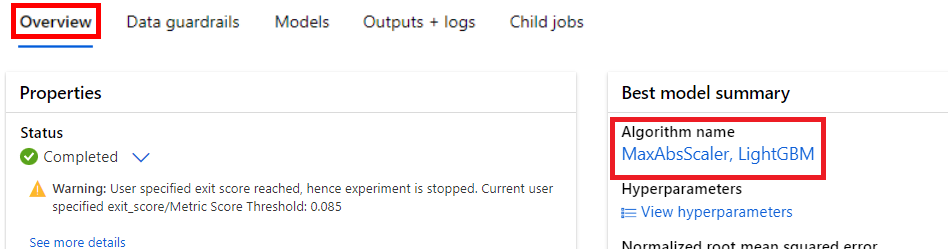

---
lab:
  title: Menjelajahi Pembelajaran Mesin Otomatis di Azure ML
---

# Menjelajahi Pembelajaran Mesin Otomatis di Azure ML

> **Catatan** Untuk menyelesaikan lab ini, Anda memerlukan [langganan Azure](https://azure.microsoft.com/free?azure-portal=true) dengan akses administrator.

Dalam latihan ini, Anda akan menggunakan himpunan data detail persewaan sepeda historis untuk melatih model yang memprediksi jumlah persewaan sepeda yang diharapkan pada hari tertentu, berdasarkan fitur musiman dan meteorologi.

## Membuat ruang kerja Azure Machine Learning  

1. Masuk ke [portal Azure](https://portal.azure.com?azure-portal=true) menggunakan info masuk Microsoft Anda.

1. Pilih **+ Buat sumber daya**, cari *Pembelajaran Mesin*, dan buat sumber daya **Azure Machine Learning** baru dengan paket *Azure Machine Learning*. Gunakan pengaturan berikut:
    - **Langganan**: *Langganan Azure Anda*.
    - **Grup sumber daya**: *Buat atau pilih grup sumber daya*.
    - **Nama ruang kerja**: *Masukkan nama unik untuk ruang kerja Anda*.
    - **Wilayah**: *Pilih wilayah geografis terdekat*.
    - **Akun penyimpanan**: *Perhatikan akun penyimpanan default baru yang akan dibuat untuk ruang kerja Anda*.
    - **Key vault**: *Perhatikan key vault baru bawaan yang akan dibuat untuk ruang kerja Anda*.
    - **Application insights**: *Perhatikan sumber daya application insights baru bawaan yang akan dibuat untuk ruang kerja Anda*.
    - **Registri kontainer**: Tidak ada (*kontainer akan dibuat secara otomatis saat pertama kali menyebarkan model ke kontainer*).

1. Pilih **Tinjau + buat**, lalu pilih **Buat**. Tunggu hingga ruang kerja Anda dibuat (dapat memakan waktu beberapa menit), lalu buka sumber daya yang disebarkan.

1. Pilih **Luncurkan studio** (atau buka tab browser baru dan arahkan ke [https://ml.azure.com](https://ml.azure.com?azure-portal=true), dan masuk ke studio Azure Machine Learning menggunakan akun Microsoft Anda).

1. Tutup semua pesan yang ditampilkan.

1. Di studio Azure Machine Learning, Anda akan melihat ruang kerja yang baru dibuat. Jika tidak demikian, pilih direktori Azure Anda di menu sebelah kiri. Kemudian dari menu sebelah kiri baru pilih **Ruang Kerja**, tempat semua ruang kerja yang terkait dengan direktori Anda dicantumkan, dan pilih yang Anda buat untuk latihan ini.

> **Catatan** Modul ini adalah salah satu dari banyak modul yang memanfaatkan ruang kerja Azure Machine Learning, termasuk modul lainnya di jalur pembelajaran [Dasar-Dasar AI Microsoft Azure: Menjelajahi alat visual untuk pembelajaran mesin](https://docs.microsoft.com/learn/paths/create-no-code-predictive-models-azure-machine-learning/). Jika menggunakan langganan Azure Anda sendiri, Anda dapat mempertimbangkan untuk membuat ruang kerja sekali dan menggunakannya kembali di modul lain. Langganan Azure Anda akan dikenakan biaya kecil untuk penyimpanan data selama ruang kerja Azure Machine Learning ada di langganan Anda, jadi sebaiknya hapus ruang kerja Azure Machine Learning saat tidak lagi diperlukan.

## Membuat aset data

1. Lihat data yang dipisahkan koma di [https://aka.ms/bike-rentals](https://aka.ms/bike-rentals?azure-portal=true) di browser web Anda.

1. Di [studio Azure Machine Learning](https://ml.azure.com?azure-portal=true), perluas panel kiri dengan memilih ikon menu di kiri atas layar. Lihat halaman **Data** (di bagian **Aset**). Halaman Data berisi file atau tabel data tertentu yang Anda rencanakan untuk digunakan di Azure ML. Anda juga dapat membuat himpunan data dari halaman ini.

1. Pada halaman **Data** , di bawah tab **Aset data** , pilih **+ Buat**. Kemudian konfigurasikan aset data dengan pengaturan berikut:
    * **Jenis data**:
        * **Nama**: bike-rentals
        * **Deskripsi**: Data penyewaan sepeda
        * **Jenis himpunan data**: Tabular
    * **Sumber data**: Dari File Web
    * **URL Web**: 
        * **URL Web**: [https://aka.ms/bike-rentals](https://aka.ms/bike-rentals?azure-portal=true)
        * **Lewati validasi data**: *jangan pilih*
    * **Pengaturan**:
        * **Format file**: Dibatasi
        * **Pemisah**: Koma
        * **Pengodean**: UTF-8
        * **Header kolom**: Hanya file pertama yang memiliki header
        * **Lewati baris**: Tidak ada
        * **Himpunan data berisi data multi-baris**: *jangan pilih*
    * **Skema**:
        * Sertakan semua kolom selain **Jalur**
        * Meninjau jenis yang terdeteksi secara otomatis
    * **Tinjau**
        * Pilih **Buat**

1. Setelah himpunan data dibuat, buka dan tampilkan halaman **Jelajahi** untuk melihat sampel data. Data ini berisi fitur dan label historis untuk penyewaan sepeda.

> **Kutipan**: *Data ini berasal dari [Capital Bikeshare](https://www.capitalbikeshare.com/system-data) dan digunakan sesuai dengan [perjanjian lisensi](https://www.capitalbikeshare.com/data-license-agreement)* data yang diterbitkan.

## Aktifkan Komputasi Tanpa Server

1. Di Azure Machine Learning Studio, klik **kelola fitur pratinjau** (ikon speaker keras).


1. Aktifkan fitur "Pengalaman terpandu untuk mengirimkan pekerjaan pelatihan dengan komputasi tanpa server".


## Menjalankan tugas pembelajaran mesin otomatis

Ikuti langkah selanjutnya untuk menjalankan tugas yang menggunakan pembelajaran mesin otomatis untuk melatih model regresi yang memprediksi persewaan sepeda.

1. Di [studio Azure Machine Learning](https://ml.azure.com?azure-portal=true), lihat halaman **ML Otomatis** (di bawah **Penulisan**).

1. Buat tugas ML Otomatis dengan pengaturan berikut:
    - **Pilih aset data**:
        - **Himpunan data**: bike-rentals
    - **Konfigurasikan pekerjaan**:
        - **Nama eksperimen baru**:mslearn-bike-rental
        - **Kolom target**: persewaan (*ini adalah label yang modelnya dilatih untuk memprediksi)*
        - **Pilih kluster komputasi Azure ML**: *kluster komputasi yang Anda buat sebelumnya*.
    - **Pilih tugas dan pengaturan**: 
        - **Jenis tugas**: Regresi *(model memprediksi nilai numerik)* 

    

    Perhatikan di bagian jenis tugas terdapat pengaturan *Lihat pengaturan konfigurasi tambahan* dan *Tampilkan pengaturan fitur*. Sekarang konfigurasikan pengaturan ini.

    - **Setelan konfigurasi tambahan:**
        - **Metrik utama**: Pilih **root mean squared error yang dinormalisasi**
        - **Jelaskan model terbaik**: Dipilih — *opsi ini membuat pembelajaran mesin otomatis menghitung pentingnya fitur untuk model terbaik yang memungkinkan menentukan pengaruh setiap fitur pada label yang diprediksi.*
        - **Gunakan semua model yang didukung**: <u>Tidak</u>dipilih. *Anda akan membatasi pekerjaan untuk mencoba hanya beberapa algoritma tertentu.*
        - **Model yang diizinkan**: *Pilih hanya **RandomForest** dan **LightGBM** — biasanya Anda ingin mencoba sebanyak mungkin, tetapi setiap model yang ditambahkan akan menambah waktu yang dibutuhkan untuk menjalankan pekerjaan.*

        
Perhatikan di bawah *Tampilkan pengaturan konfigurasi tambahan* adalah bagian *Batas* . Perluas bagian untuk mengonfigurasi pengaturan:
        - **Waktu habis (menit)**: 30 — *mengakhiri pekerjaan setelah maksimal 30 menit.*
        - **Ambang skor metrik**: 0,085 — *jika model mencapai skor metrik root mean squared error yang dinormalisasi sebesar 0,085 atau kurang, pekerjaan akan berakhir.*
        - Klik **Berikutnya**
        - **Komputasi**: tidak ada perubahan yang diperlukan di sini
        - Klik **Berikutnya**
1. Setelah Anda selesai mengirimkan detail pekerjaan pembelajaran mesin otomatis, pekerjaan ini akan dimulai secara otomatis.

1. Tunggu pekerjaan selesai. Mungkin perlu waktu — sekarang mungkin saat yang tepat untuk istirahat sejenak!

## Meninjau model terbaik

1. Di tab **Ringkasan** tugas pembelajaran mesin otomatis, perhatikan ringkasan model terbaik.
    

    > **Catatan** Anda mungkin melihat pesan di bawah status "Peringatan: Skor keluar yang ditentukan pengguna tercapai...". Ini adalah pesan yang diharapkan. Lanjutkan ke langkah berikutnya.  
1. Pilih teks di bawah **Nama algoritma** untuk model terbaik guna melihat detailnya.

1. Di samping nilai *Kesalahan kuadrat rata-rata akar yang dinormalkan*, pilih **Tampilkan semua metrik lainnya** untuk melihat nilai metrik evaluasi lain yang mungkin untuk model regresi.

    

1. Pilih tab **Metrik** dan pilih bagan **residuals** dan **predicted_true** jika belum dipilih. 
    

    Tinjau grafik yang menunjukkan performa model. Bagan pertama menunjukkan *sisa*, perbedaan antara nilai prediksi dan nilai aktual, sebagai histogram, bagan kedua membandingkan nilai prediksi dengan nilai sebenarnya.

1. Pilih tab **Penjelasan**. Pilih ID Penjelasan, lalu pilih **Kepentingan fitur gabungan**. Bagan ini menunjukkan seberapa besar setiap fitur dalam himpunan data memengaruhi prediksi label, seperti ini:

    

## Menyebarkan layanan prediktif

1. Di [Studio Azure Machine Learning](https://ml.azure.com?azure-portal=true), pada halaman **ML Otomatis**, pilih tugas pembelajaran mesin otomatis Anda.

1. Pada tab **Ringkasan**, pilih nama algoritma untuk model terbaik.

    

1. Pada tab **Model** , pilih tombol **Sebarkan** dan gunakan opsi **Layanan web** untuk menyebarkan model dengan pengaturan berikut:
    - **Nama**: predict-rentals
    - **Deskripsi**: Memprediksi penyewaan sepeda
    - **Jenis komputasi**: Azure Container Instance
    - **Aktifkan autentikasi**: Dipilih

1. Tunggu penyebaran dimulai - ini mungkin memakan waktu beberapa detik.

1. Di studio Azure Machine Learning, di menu sebelah kiri, pilih **Titik akhir** dan buka titik akhir real time **predict-rentals** .
1. Tunggu status **Penyebaran** berubah menjadi **Sehat** - ini mungkin memakan waktu beberapa menit.

## Menguji layanan yang disebarkan

Sekarang Anda dapat menguji layanan yang disebarkan.

1. Pada halaman titik akhir real-time **predict-rentals** hapus tab **Uji** .

1. Di panel **Input data untuk menguji titik akhir** , ganti templat JSON dengan data input berikut:

    ```JSON
    {
      "Inputs": { 
        "data": [
          {
            "day": 1,
            "mnth": 1,   
            "year": 2022,
            "season": 2,
            "holiday": 0,
            "weekday": 1,
            "workingday": 1,
            "weathersit": 2, 
            "temp": 0.3, 
            "atemp": 0.3,
            "hum": 0.3,
            "windspeed": 0.3 
          }
        ]    
      },   
      "GlobalParameters": 1.0
    }
    ```

1. Klik tombol **Uji**.

1. Tinjau hasil pengujian, yang mencakup perkiraan jumlah persewaan berdasarkan fitur input. Panel pengujian mengambil data input dan menggunakan model yang Anda latih untuk menampilkan perkiraan jumlah persewaan.

    

Mari kita tinjau yang telah Anda lakukan. Anda menggunakan himpunan data tentang data penyewaan sepeda historis untuk melatih model. Model ini memprediksi jumlah penyewaan sepeda yang diharapkan pada hari tertentu, berdasarkan *fitur* musiman dan meteorologi. Dalam hal ini, *label* adalah jumlah penyewaan sepeda.

Anda baru saja menguji layanan yang siap untuk dihubungkan ke aplikasi klien menggunakan kredensial di tab **Konsumsi**. Kami akan mengakhiri lab di sini. Anda dipersilakan untuk terus bereksperimen dengan layanan yang baru saja Anda sebarkan.

## Pembersihan

Layanan web yang Anda buat dihosting dalam *Azure Container Instance*. Jika tidak berniat untuk bereksperimen dengan ini lebih lanjut, Anda harus menghapus titik akhir untuk menghindari mengumpulkan penggunaan Azure yang tidak perlu. Anda juga harus menghapus kluster komputasi.

1. Di [studio Azure Machine Learning](https://ml.azure.com?azure-portal=true), di tab **Titik Akhir**, pilih titik akhir **predict-rentals**. Kemudian pilih **Hapus** dan konfirmasikan bahwa Anda ingin menghapus titik akhir.

> **Catatan** Menghapus komputasi Anda memastikan langganan Anda tidak akan dikenakan biaya untuk sumber daya komputasi. Namun Anda akan dikenakan biaya kecil untuk penyimpanan data selama ruang kerja Azure Machine Learning ada di langganan Anda. Jika telah selesai menjelajahi Azure Machine Learning, Anda dapat menghapus ruang kerja Azure Machine Learning dan sumber daya terkait. Namun, jika berencana untuk menyelesaikan laboratorium lain dalam seri ini, Anda harus membuatnya kembali.
>
> Untuk menghapus ruang kerja Anda:
> 1. Di [portal Azure](https://portal.azure.com?azure-portal=true), di halaman **Grup sumber daya**, buka grup sumber daya yang Anda tentukan saat membuat ruang kerja Azure Machine Learning Anda.
> 2. Klik **Hapus grup sumber daya**, ketik nama grup sumber daya untuk mengonfirmasi bahwa Anda ingin menghapusnya, dan pilih **Hapus**.
