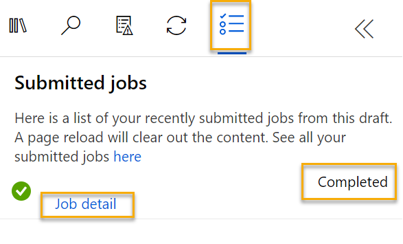

---
lab:
  title: Menjelajahi regresi dengan Azure Machine Learning Designer
  module: Module 2 - Machine Learning
---

# <a name="explore-regression-with-azure-machine-learning-designer"></a>Menjelajahi regresi dengan Azure Machine Learning Designer

> **Catatan** Untuk menyelesaikan lab ini, Anda memerlukan [langganan Azure](https://azure.microsoft.com/free?azure-portal=true) dengan akses administrator.

Dalam latihan ini, Anda akan melatih model regresi yang memprediksi harga mobil berdasarkan karakteristiknya.

## <a name="create-an-azure-machine-learning-workspace"></a>Membuat ruang kerja Azure Machine Learning  

1. Masuk ke [portal Azure](https://portal.azure.com?azure-portal=true) menggunakan info masuk Microsoft Anda.

1. Pilih **+ Buat sumber daya**, cari *Pembelajaran Mesin*, dan buat sumber daya **Azure Machine Learning** baru dengan paket *Azure Machine Learning*. Gunakan pengaturan berikut:
    - **Langganan**: *Langganan Azure Anda*.
    - **Grup sumber daya**: *Buat atau pilih grup sumber daya*.
    - **Nama ruang kerja**: *Masukkan nama unik untuk ruang kerja Anda*.
    - **Wilayah**: *Pilih wilayah geografis terdekat*.
    - **Akun penyimpanan**: *Perhatikan akun penyimpanan default baru yang akan dibuat untuk ruang kerja Anda*.
    - **Key vault**: *Perhatikan key vault baru bawaan yang akan dibuat untuk ruang kerja Anda*.
    - **Application insights**: *Perhatikan sumber daya application insights baru bawaan yang akan dibuat untuk ruang kerja Anda*.
    - **Registri kontainer**: Tidak ada (*satu registri kontainer akan dibuat secara otomatis saat pertama kali Anda menyebarkan model ke kontainer*)

1. Pilih **Tinjau + buat**, lalu pilih **Buat**. Tunggu hingga ruang kerja Anda dibuat (dapat memakan waktu beberapa menit), lalu buka sumber daya yang disebarkan.

1. Pilih **Luncurkan studio** (atau buka tab browser baru dan arahkan ke [https://ml.azure.com](https://ml.azure.com?azure-portal=true), dan masuk ke studio Azure Machine Learning menggunakan akun Microsoft Anda).

1. Di studio Azure Machine Learning, Anda akan melihat ruang kerja yang baru dibuat. Jika tidak, klik **Microsoft** di menu sebelah kiri. Kemudian dari menu sebelah kiri yang baru, pilih **Ruang Kerja**, tempat semua ruang kerja yang terkait dengan langganan Anda dicantumkan. Pilih salah satu yang Anda buat untuk latihan ini. 

> **Catatan** Modul ini adalah salah satu dari banyak modul yang memanfaatkan ruang kerja Azure Machine Learning, termasuk modul lainnya di jalur pembelajaran [Dasar-Dasar AI Microsoft Azure: Menjelajahi alat visual untuk pembelajaran mesin](https://docs.microsoft.com/learn/paths/create-no-code-predictive-models-azure-machine-learning/). Jika menggunakan langganan Azure Anda sendiri, Anda dapat mempertimbangkan untuk membuat ruang kerja sekali dan menggunakannya kembali di modul lain. Langganan Azure Anda akan dikenakan biaya kecil untuk penyimpanan data selama ruang kerja Azure Machine Learning ada di langganan Anda, jadi sebaiknya hapus ruang kerja Azure Machine Learning saat tidak lagi diperlukan.

## <a name="create-compute"></a>Membuat komputasi

1. Di [studio Azure Machine Learning](https://ml.azure.com?azure-portal=true), pilih tiga baris di kiri atas untuk melihat berbagai halaman di antarmuka (Anda mungkin perlu memaksimalkan ukuran layar). Anda dapat menggunakan halaman ini di panel sebelah kiri untuk mengelola sumber daya di ruang kerja Anda. Pilih halaman **Komputasi** (di bagian **Kelola**).

1. Pada halaman **Komputasi**, pilih tab **Kluster komputasi**, dan tambahkan kluster komputasi baru dengan pengaturan berikut untuk melatih model pembelajaran mesin:
    - **Lokasi**: *Pilih lokasi yang sama dengan ruang kerja Anda. Jika lokasi tersebut tidak terdaftar, pilih yang terdekat dengan lokasi Anda*.
    - **Tingkatan mesin virtual**: Khusus
    - **Jenis mesin virtual**: CPU
    - **Ukuran mesin virtual**:
        - Pilih opsi **Pilih dari semua opsi**
        - Cari dan pilih **Standard_DS11_v2**
    - Pilih **Selanjutnya**
    - **Nama komputasi**: *masukkan nama unik*
    - **Jumlah minimum node**: 0
    - **Jumlah maksimum node**: 2
    - **Detik menganggur sebelum menurunkan skala**: 120
    - **Aktifkan akses SSH**: Hapus
    - Pilih **Buat**

> **Catatan** Instans dan kluster Komputasi didasarkan pada gambar mesin virtual Azure standar. Untuk modul ini, gambar *Standard_DS11_v2* disarankan untuk mencapai keseimbangan biaya dan performa yang optimal. Jika langganan Anda memiliki kuota yang tidak menyertakan gambar ini, pilih gambar alternatif; tetapi perlu diingat bahwa gambar yang lebih besar dapat dikenakan biaya yang lebih tinggi dan gambar yang lebih kecil mungkin tidak cukup untuk menyelesaikan tugas. Atau, minta administrator Azure Anda memperpanjang kuota Anda.

Kluster komputasi akan membutuhkan waktu untuk dibuat. Anda dapat melanjutkan ke langkah berikutnya sambil menunggu.

## <a name="create-a-pipeline-in-designer"></a>Membuat alur di Perancang 

1. Di [Azure Machine Learning studio](https://ml.azure.com?azure-portal=true), perluas panel kiri dengan memilih ikon tiga garis di kiri atas layar. Lihat halaman **Desainer** (di bagian **Pembuat**), dan pilih **+** untuk membuat alur baru.

1. Di sisi kanan atas layar, pilih **Pengaturan**. Jika panel **Pengaturan** tidak terlihat, pilih ikon roda di samping nama saluran di bagian atas.

1. Di **Pengaturan**, Anda harus menentukan target komputasi untuk menjalankan alur. Di bagian **Pilih jenis komputasi**, pilih **Kluster komputasi**. Kemudian di bagian **Pilih kluster komputasi Azure ML**, pilih kluster komputasi yang Anda buat sebelumnya.

1. Di **Pengaturan**, pada **Detail draf**, ubah nama draf (**Pipeline-Created-on-* date***) menjadi **Pelatihan Harga Otomatis**.

1. Pilih *ikon tutup* di kanan atas panel **Pengaturan** untuk menutup panel. 


## <a name="add-and-explore-a-dataset"></a>Menambahkan dan menjelajahi himpunan data

Azure Machine Learning menyertakan himpunan data sampel yang dapat Anda gunakan untuk model regresi Anda.

1. Di sebelah nama saluran di sebelah kiri, pilih ikon panah untuk memperluas panel jika belum diperluas. Panel akan terbuka secara default ke panel **Pustaka aset**, yang ditunjukkan dengan ikon buku di bagian atas panel. Terdapat bilah pencarian untuk menemukan aset di panel dan dua tombol, **Data** dan **Komponen**.

    

1. Klik **Komponen**. Telusuri dan tempatkan himpunan data dari **Data harga mobil (Mentah)** ke kanvas.

1. Klik kanan (Ctrl+klik pada Mac) himpunan data dari **Data harga mobil (Raw)** di kanvas, dan klik **Pratinjau data**.

1. Tinjau skema *Output himpunan data* dari data, dengan mencatat bahwa Anda dapat melihat distribusi berbagai kolom sebagai histogram.

1. Gulir ke kanan himpunan data hingga Anda melihat kolom **Harga**, yang merupakan label yang diprediksi model Anda.

1. Gulir kembali ke kiri dan pilih header kolom **normalized-losses**. Kemudian tinjau statistik untuk kolom ini. Perhatikan ada beberapa nilai yang hilang di kolom ini. Nilai yang hilang membatasi kegunaan kolom untuk memprediksi label **harga** sehingga Anda mungkin ingin mengecualikannya dari pelatihan.

1. Tutup jendela **Visualisasi hasil data harga mobil (Mentah)** agar Anda dapat melihat himpunan data di kanvas seperti ini:

    

## <a name="add-data-transformations"></a>Menambahkan transformasi data

Anda biasanya menerapkan transformasi data guna menyiapkan data untuk pemodelan. Dalam hal data harga mobil, Anda menambahkan transformasi untuk mengatasi masalah yang Anda identifikasi saat menjelajahi data.

1. Di panel **Pustaka aset** di sebelah kiri, klik **Komponen**, yang berisi berbagai modul yang dapat Anda gunakan untuk transformasi data dan pelatihan model. Anda juga dapat menggunakan bilah pencarian untuk menemukan modul dengan cepat.

1. Telusuri modul **Pilih Kolom di Himpunan Data** dan letakkan di kanvas, di bawah modul **Data harga mobil (Raw)**. Selanjutnya sambungkan output di bagian bawah modul **Automobile price data (Raw)** ke input di bagian atas modul **Select Columns in Dataset**, seperti ini:

    

1. Klik dua kali pada modul **Pilih Kolom di Himpunan Data** untuk mengakses panel pengaturan di sebelah kanan. Pilih **Edit kolom**. Lalu di jendela **Pilih kolom**, pilih **Menurut nama** dan **Tambahkan semua** untuk menambahkan semua kolom. Kemudian hapus **kerugian yang dinormalisasi**, sehingga pilihan kolom akhir Anda terlihat seperti ini:

    

1. Klik tombol **Simpan**.

Di sisa latihan ini, Anda akan melalui langkah-langkah untuk membuat alur yang terlihat seperti ini:


Ikuti langkah selanjutnya, gunakan gambar untuk referensi saat Anda menambahkan dan mengonfigurasi modul yang diperlukan.

1. Di **Pustaka Aset**, cari modul **Bersihkan Data yang Hilang** dan letakkan di bawah modul **Pilih Kolom di Himpunan Data** di kanvas. Selanjutnya sambungkan output dari modul **Select Columns in Dataset** ke input dari modul **Clean Missing Data**.

1. Klik dua kali modul **Membersihkan Data yang Hilang**, dan di panel sebelah kanan, klik **Edit kolom**. Kemudian di jendela **Kolom yang akan dihapus**, pilih **Dengan aturan**, di daftar **Sertakan** pilih **Nama kolom**, di kotak nama kolom, masukkan **bore**, **stroke**, dan **horsepower** seperti ini:

    

1. Dengan modul **Membersihkan Data yang Hilang** masih dipilih, di panel sebelah kanan, tetapkan pengaturan konfigurasi berikut:
    - **Rasio nilai hilang minimum**: 0,0
    - **Rasio nilai maksimum yang hilang**: 1,0
    - **Mode pembersihan**: Hapus seluruh baris

    >**Tips** Jika Anda melihat statistik untuk kolom **bore**, **stroke**, dan **horsepower**, Anda akan melihat sejumlah nilai hilang. Kolom ini memiliki lebih sedikit nilai yang hilang daripada **kerugian yang dinormalisasi**, sehingga mungkin masih dapat digunakan untuk memprediksi **harga** setelah Anda mengecualikan baris yang tidak memiliki nilai dari pelatihan.

1. Di **Pustaka aset**, cari modul **Normalisasi Data dan letakkan** di kanvas, di bawah modul **Bersihkan Data yang Hilang**. Kemudian, sambungkan output paling kiri dari modul **Bersihkan Data yang Hilang** ke input modul **Normalisasi Data**.

1. Klik dua kali pada modul **Normalisasi Data** untuk melihat panel parameternya. Anda perlu menentukan metode transformasi dan kolom yang akan diubah. Tetapkan metode transformasi ke **MinMax**. Terapkan aturan dengan memilih **Edit kolom** untuk menyertakan **Nama kolom** berikut:
    - **symboling**
    - **wheel-base**
    - **length**
    - **width**
    - **height**
    - **curb-weight**
    - **engine-size**
    - **bore**
    - **stroke**
    - **compression-ratio**
    - **horsepower**
    - **peak-rpm**
    - **city-mpg**
    - **highway-mpg**

    

    >**Tips** Jika Anda membandingkan nilai dalam kolom **stroke**, **peak-rpm**, dan **city-mpg**, semuanya diukur dengan skala yang berbeda, dan mungkin saja nilai yang lebih besar untuk **rpm-puncak** dapat membiaskan algoritma pelatihan dan membuat dependensi berlebih pada kolom ini dibandingkan dengan kolom dengan nilai yang lebih rendah, seperti **stroke**. Biasanya, ilmuwan data mengurangi kemungkinan bias ini dengan *menormalkan* kolom numerik agar skalanya sama.

## <a name="run-the-pipeline"></a>Menjalankan alur

Untuk menerapkan transformasi data, Anda harus menjalankan alur.

1. Pastikan alur Anda terlihat mirip dengan gambar ini:

    

1. Pilih **Kirim**, dan buat eksperimen baru bernama **mslearn-auto-training** di kluster komputasi Anda.

1. Tunggu hingga proses selesai, yang mungkin memakan waktu 5 menit atau lebih.

    

    Perhatikan bahwa panel sebelah kiri sekarang berada di panel **Pekerjaan yang Dikirim**. Anda akan mengetahui kapan eksekusi selesai karena status pekerjaan akan berubah menjadi **Selesai**. 

1. Setelah eksekusi selesai, klik **Detail pekerjaan**. Tab baru akan terbuka, dan Anda akan melihat komponen yang telah selesai dengan tanda centang seperti ini:

    

Himpunan data sekarang disiapkan untuk pelatihan model. Tutup tab Detail pekerjaan untuk kembali ke alur.

## <a name="create-training-pipeline"></a>Membuat alur pelatihan

Setelah menggunakan transformasi data untuk menyiapkan data, Anda dapat menggunakannya untuk melatih model pembelajaran mesin. Lakukan langkah-langkah berikut untuk memperluas jalur **Pelatihan Harga Otomatis**.

1. Kembali ke jalur **Pelatihan Harga Otomatis** yang Anda buat di unit sebelumnya jika belum dibuka.

1. Di panel **Pustaka aset** di sebelah kiri, cari dan tempatkan modul **Pisahkan Data** ke kanvas di bawah modul **Normalisasi Data**. Selanjutnya sambungkan output *Himpunan Data yang Diubah* (kiri) dari modul **Normalize Data** ke input modul **Split Data**.

    >**Tips** Gunakan bilah pencarian untuk menemukan modul dengan cepat. 

1. Klik dua kali pada modul **Pisahkan Data**, dan konfigurasikan pengaturannya sebagai berikut:
    * **Mode pemisahan**: Pisahkan Baris
    * **Pecahan baris dalam himpunan data output pertama**: 0,7
    * **Pemisahan secara acak**: Benar
    * **Nilai awal acak**: 123
    * **Pemisahan bertingkat**: False

1. Di **Pustaka Aset**, cari dan tempatkan modul **Latih Model** ke kanvas, di bawah modul **Pisahkan Data**. Kemudian hubungkan output *Hasil dataset1* (kiri) dari modul **Pisahkan Data** ke input *Himpunan data* (kanan) dari modul **Latih Model**.

1. Model yang Anda latih akan memprediksi nilai **harga**, jadi pilih modul **Latih Model** dan ubah pengaturannya untuk mengatur **kolom Label** ke **harga** (sama persis dengan huruf besar dan ejaannya!)

    Label **harga** yang akan diprediksi model adalah nilai numerik, jadi, kita perlu melatih model menggunakan algoritma *regresi*.

1. Di **Pustaka aset**, cari dan tempatkan modul **Regresi Linier** ke kanvas, di sebelah kiri modul **Pisahkan Data** dan di atas modul **Latih Model**. Selanjutnya sambungkan output-nya ke input **model Untrained** (kiri) dari modul **Train Model**.

    > **Catatan** Ada beberapa algoritma yang dapat Anda gunakan untuk melatih model regresi. Untuk membantu memilih satu algoritma, lihat [Contekan Algoritma Machine Learning untuk perancang Azure Machine Learning](https://aka.ms/mlcheatsheet?azure-portal=true).

    Untuk menguji model terlatih, kita perlu menggunakannya untuk *mengevaluasi* himpunan data validasi yang kita pertahankan ketika membagi data asli - dengan kata lain, prediksi fitur label dalam himpunan data validasi.
 
1. Di **Pustaka Aset**, cari dan tempatkan modul **Nilai Model** ke kanvas, di bawah modul **Latih Model**. Selanjutnya sambungkan output modul **Train Model** ke input **Trained model** (kiri) dari modul **Score Model**; dan seret output **Hasil dataset2** (kanan) dari modul **Split Data** ke input **Himpunan data** (kanan) dari modul **Score Model**.

1. Pastikan alur Anda terlihat seperti gambar ini:

    

## <a name="run-the-training-pipeline"></a>Menjalankan alur pelatihan

Sekarang Anda siap menjalankan alur pelatihan dan melatih model.

1. Pilih **Kirim**, dan jalankan alur menggunakan eksperimen yang ada bernama **mslearn-auto-training**.

1. Eksperimen ini akan memerlukan waktu 5 menit atau lebih untuk selesai. Saat percobaan berjalan selesai, klik **Detail pekerjaan**. Anda akan dibawa ke tab baru.

1. Di jendela baru, klik kanan pada modul **Model Skor** dan pilih **Pratinjau data** lalu **Himpunan data** skor untuk melihat hasilnya.

1. Gulir ke kanan, dan perhatikan bahwa di samping kolom **harga** (yang berisi nilai sebenarnya dari label yang diketahui) terdapat kolom baru bernama **Label yang Dinilai**, yang berisi nilai label yang diprediksi.

1. Tutup tab **visualisasi hasil Nilai Model**.

Model ini memprediksi nilai untuk label **harga**, tetapi seberapa andal prediksinya? Untuk menilai itu, Anda perlu mengevaluasi model.

## <a name="evaluate-model"></a>Mengevaluasi model

Salah satu cara untuk mengevaluasi model regresi adalah dengan membandingkan label yang diprediksi dengan label aktual dalam himpunan data validasi yang akan ditahan selama pelatihan. Cara lain adalah dengan membandingkan performa beberapa model.

1. Buka alur **Pelatihan Harga Otomatis** yang Anda buat.

1. Di **Pustaka Aset**, cari dan tempatkan modul **Evaluasi Model** ke kanvas, di bawah modul **Nilai Model**, dan hubungkan output dari modul **Nilai Model** ke input **Himpunan data yang dinilai** (kiri) dari modul **Evaluasi Model**.

1. Pastikan alur Anda terlihat seperti ini:

    

1. Pilih **Kirim**, dan jalankan alur menggunakan eksperimen yang ada bernama **mslearn-auto-training**.

1. Tunggu hingga eksekusi eksperimen selesai.

    

1. Setelah percobaan selesai, pilih **Detail pekerjaan**, yang akan membuka tab lain. Temukan dan klik kanan pada modul **Evaluasi Model**. Pilih **Pratinjau data** lalu **Hasil evaluasi**.

    

1. Di panel *Evaluation_results*, tinjau metrik performa regresi:
    - **Mean Absolute Error (MAE)**
    - **Root Mean Squared Error (RMSE)**
    - **Relative Squared Error (RSE)**
    - **Relative Absolute Error (RAE)**
    - **Coefficient of Determination (R<sup>2</sup>)**
1. Tutup panel *Evaluation_results*.

Saat mengidentifikasi model dengan metrik evaluasi yang memenuhi kebutuhan Anda, Anda dapat bersiap menggunakan model tersebut dengan data baru.

## <a name="create-and-run-an-inference-pipeline"></a>Membuat dan menjalankan alur inferensi

1. Di Azure Machine Learning studio, luaskan panel sebelah kiri dengan memilih tiga baris di kiri atas layar. Klik **Pekerjaan** (di bagian **Aset**) untuk melihat semua pekerjaan yang telah Anda jalankan. Pilih eksperimen **mslearn-auto-training**, lalu pilih alur **mslearn-auto-training**. 

    

1. Cari menu di atas kanvas dan klik **Buat alur inferensi**. Anda mungkin perlu memperluas layar hingga penuh dan mengeklik ikon tiga titik **...** di sudut kanan atas layar untuk menemukan **Buat alur inferensi** di menu.  

    

1. Di daftar drop-down **Buat alur masuk**, klik **Alur inferensi real-time**. Setelah beberapa detik, versi baru alur Anda bernama **Inferensi real-time Pelatihan Harga Otomatis** akan dibuka.

    *Jika alur tidak menyertakan modul **Input Layanan Web** dan **Output Layanan Web**, kembali ke halaman **Perancang** lalu buka kembali ** Alur inferensi real time Pelatihan Harga Otomatis**.*

1. Ganti nama alur baru menjadi **Prediksi Harga Otomatis**, lalu tinjau alur baru. Alur ini berisi input layanan web untuk data baru yang akan dikirimkan, dan output layanan web untuk mengembalikan hasil. Beberapa langkah transformasi dan pelatihan adalah bagian dari alur ini. Model yang dilatih akan digunakan untuk menilai data baru.

    Anda akan membuat perubahan berikut pada alur inferensi pada langkah #5-9 berikutnya:

    

   Gunakan gambar sebagai referensi saat Anda memodifikasi alur di langkah berikutnya.

1. Alur inferensi menganggap data baru akan cocok dengan skema data pelatihan asli, sehingga himpunan data **Data harga mobil (Mentah)** dari alur pelatihan disertakan. Namun, data input ini menyertakan label **harga** yang diprediksi model, yang tidak intuitif untuk disertakan dalam data mobil baru yang prediksi harganya belum dibuat. Hapus modul ini dan ganti dengan modul **Enter Data Manually** dari bagian **Input dan Output Data**, yang berisi data CSV berikut, yang mencakup nilai fitur tanpa label untuk tiga mobil (salin dan tempel seluruh blok teks):

    ```CSV
    symboling,normalized-losses,make,fuel-type,aspiration,num-of-doors,body-style,drive-wheels,engine-location,wheel-base,length,width,height,curb-weight,engine-type,num-of-cylinders,engine-size,fuel-system,bore,stroke,compression-ratio,horsepower,peak-rpm,city-mpg,highway-mpg
    3,NaN,alfa-romero,gas,std,two,convertible,rwd,front,88.6,168.8,64.1,48.8,2548,dohc,four,130,mpfi,3.47,2.68,9,111,5000,21,27
    3,NaN,alfa-romero,gas,std,two,convertible,rwd,front,88.6,168.8,64.1,48.8,2548,dohc,four,130,mpfi,3.47,2.68,9,111,5000,21,27
    1,NaN,alfa-romero,gas,std,two,hatchback,rwd,front,94.5,171.2,65.5,52.4,2823,ohcv,six,152,mpfi,2.68,3.47,9,154,5000,19,26
    ```

1. Sambungkan modul **Enter Data Manually** ke input **himpunan data** yang sama dari modul **Select Columns in Dataset** sebagai **Web Service Input**.

1. Sekarang setelah Anda mengubah skema data masuk untuk mengecualikan bidang **harga**, Anda perlu menghapus penggunaan eksplisit bidang ini di modul yang tersisa. Pilih modul **Select Columns in Dataset**, lalu di panel pengaturan, edit kolom untuk menghapus bidang **harga**.

1. Alur inferensi menyertakan modul **Evaluasi Model**, yang tidak berguna saat memprediksi dari data baru, jadi hapus modul ini.

1. Output dari modul **Model Skor** mencakup semua fitur input dan label yang diprediksi. Untuk mengubah output agar hanya menyertakan prediksi:
    - Hapus koneksi antara modul **Score Model** dan **Web Service Output**.
    - Tambahkan modul **Eksekusi Skrip Python** dari bagian **Bahasa Python**, ganti semua skrip python default dengan kode berikut (yang hanya memilih kolom **Label Skor** dan ganti namanya menjadi **predicted_price**):

```Python
import pandas as pd

def azureml_main(dataframe1 = None, dataframe2 = None):

    scored_results = dataframe1[['Scored Labels']]
    scored_results.rename(columns={'Scored Labels':'predicted_price'},
                        inplace=True)
    return scored_results
```

    - Hubungkan output dari modul **Score Model** ke input **Dataset1** (paling kiri) dari **Execute Python Script**, dan hubungkan output dari modul **Execute Python Script** ke **Web Service Output**.

1. Verifikasi bahwa alur Anda terlihat mirip dengan gambar berikut:

    

1. Kirim alur sebagai eksperimen baru bernama **mslearn-auto-inference** pada kluster komputasi Anda. Eksperimen mungkin memerlukan beberapa saat untuk dijalankan.

1. Setelah alur selesai, pilih **Detail pekerjaan**. Di tab baru, klik kanan modul **Jalankan Skrip Python**. Pilih **Pratinjau data** lalu **Himpunan data hasil** untuk melihat harga yang diprediksi untuk tiga mobil dalam data input.

1. Tutup tab visualisasi.

Alur inferensi Anda memprediksi harga untuk mobil berdasarkan fiturnya. Sekarang Anda siap menerbitkan alur agar aplikasi klien dapat menggunakannya.

## <a name="deploy-model"></a>Menyebarkan model

Setelah membuat dan menguji alur inferensi untuk inferensi real-time, Anda dapat menerbitkannya sebagai layanan untuk digunakan oleh aplikasi klien.

> **Catatan** Dalam latihan ini, Anda akan menyebarkan layanan web ke Azure Container Instance (ACI). Jenis komputasi ini dibuat secara dinamis, serta berguna untuk pengembangan dan pengujian. Untuk produksi, Anda harus membuat *kluster inferensi*, yang menyediakan kluster Azure Kubernetes Service (AKS) yang memberikan skalabilitas dan keamanan yang lebih baik.

## <a name="deploy-a-service"></a>Menyebarkan layanan

1. Lihat alur inferensi **Prediksi Harga Otomatis** yang Anda buat di unit sebelumnya.

1. Pilih **Detail pekerjaan** di panel sebelah kiri, yang akan membuka tab baru.

    

1. Di tab baru, pilih **Sebarkan**.

    

1. Di layar konfigurasi, pilih **Sebarkan titik akhir real time baru**, menggunakan pengaturan berikut:
    -  **Nama**: predict-auto-price
    -  **Deskripsi**: Regresi harga otomatis
    - **Jenis komputasi**: Azure Container Instance

1. Tunggu beberapa menit hingga layanan web disebarkan. Status penyebaran ditampilkan di kiri atas antarmuka perancang.

## <a name="test-the-service"></a>Menguji layanan

1. Di halaman **Titik akhir**, buka titik akhir real-time **predict-auto-price**.

    

1. Saat titik akhir **predict-auto-price** terbuka, pilih tab **Uji**. Kita akan menggunakannya untuk menguji model dengan data baru. Hapus data saat ini pada **Data input untuk menguji titik akhir real time**. Salin dan tempel data di bawah ini ke bagian data:  

    ```json
    {
    "Inputs": {
                "WebServiceInput0":
                [
                    {
                        "symboling": 3,
                        "normalized-losses": 1.0,
                        "make": "alfa-romero",
                        "fuel-type": "gas",
                        "aspiration": "std",
                        "num-of-doors": "two",
                        "body-style": "convertible",
                        "drive-wheels": "rwd",
                        "engine-location": "front",
                        "wheel-base": 88.6,
                        "length": 168.8,
                        "width": 64.1,
                        "height": 48.8,
                        "curb-weight": 2548,
                        "engine-type": "dohc",
                        "num-of-cylinders": "four",
                        "engine-size": 130,
                        "fuel-system": "mpfi",
                        "bore": 3.47,
                        "stroke": 2.68,
                        "compression-ratio": 9,
                        "horsepower": 111,
                        "peak-rpm": 5000,
                        "city-mpg": 21,
                        "highway-mpg": 27
                    }
                ]
            },
    "GlobalParameters": {}
    }
    ```

1. Pilih **Uji**. Di sisi kanan layar, Anda akan melihat **'predicted_price'** output. Output adalah harga yang diprediksi untuk kendaraan dengan fitur input tertentu yang ditentukan dalam data. 

    

Mari kita tinjau yang telah Anda lakukan. Anda membersihkan dan mengubah himpunan data dari data mobil, lalu menggunakan *fitur* mobil untuk melatih model. Model memprediksi harga mobil, yang merupakan *label*.

Anda juga menguji layanan yang siap dihubungkan ke aplikasi klien menggunakan kredensial di tab **Konsumsi**. Kami akan mengakhiri lab sampai di sini. Anda dipersilakan untuk terus bereksperimen dengan layanan yang baru saja Anda sebarkan.

## <a name="clean-up"></a>Pembersihan

Layanan web yang Anda buat dihosting dalam *Azure Container Instance*. Jika tidak berniat untuk bereksperimen dengan ini lebih lanjut, Anda harus menghapus titik akhir untuk menghindari mengumpulkan penggunaan Azure yang tidak perlu. Anda juga harus menghentikan instans komputasi hingga Anda memerlukannya lagi.

1. Di [studio Azure Machine Learning](https://ml.azure.com?azure-portal=true), pada tab **Titik Akhir**, pilih titik akhir **predict-auto-price**. Kemudian pilih **Hapus** dan konfirmasikan bahwa Anda ingin menghapus titik akhir.

1. Pada halaman **Komputasi**, pada tab **Kluster komputasi**, pilih kluster komputasi Anda, lalu pilih **Hapus**.

>**Catatan** Menghentikan komputasi memastikan langganan Anda tidak akan dikenakan biaya untuk sumber daya komputasi. Namun Anda akan dikenakan biaya kecil untuk penyimpanan data selama ruang kerja Azure Machine Learning ada di langganan Anda. Jika telah selesai menjelajahi Azure Machine Learning, Anda dapat menghapus ruang kerja Azure Machine Learning dan sumber daya terkait. Namun, jika berencana untuk menyelesaikan laboratorium lain dalam seri ini, Anda harus membuatnya kembali.
>
> Untuk menghapus ruang kerja Anda:
>
> 1. Di [portal Azure](https://portal.azure.com?azure-portal=true), di halaman **Grup sumber daya**, buka grup sumber daya yang Anda tentukan saat membuat ruang kerja Azure Machine Learning Anda.
> 1. Klik **Hapus grup sumber daya**, ketik nama grup sumber daya untuk mengonfirmasi bahwa Anda ingin menghapusnya, dan pilih **Hapus**.
