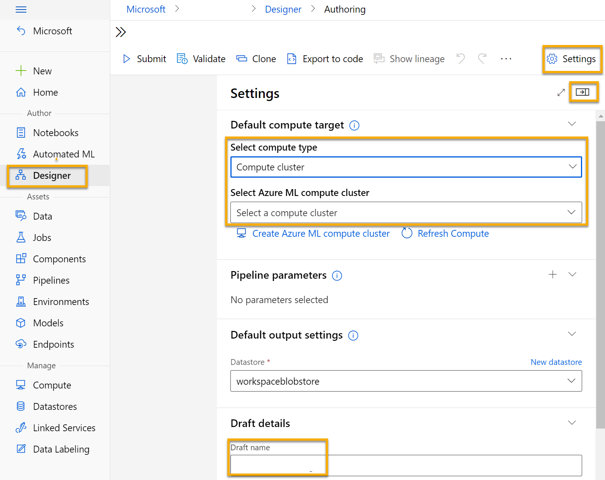
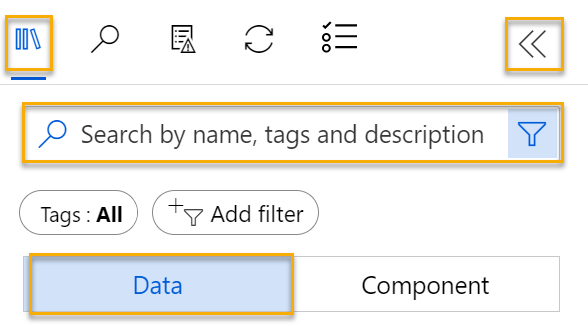
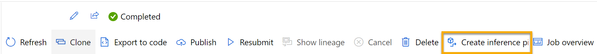
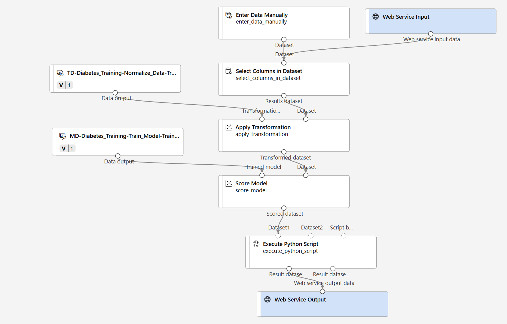

---
lab:
  title: Menjelajahi klasifikasi dengan Azure Machine Learning Designer
---

# <a name="explore-classification-with-azure-machine-learning-designer"></a>Menjelajahi klasifikasi dengan Azure Machine Learning Designer

> **Catatan** Untuk menyelesaikan lab ini, Anda memerlukan [langganan Azure](https://azure.microsoft.com/free?azure-portal=true) dengan akses administrator.

## <a name="create-an-azure-machine-learning-workspace"></a>Membuat ruang kerja Azure Machine Learning  

1. Masuk ke [portal Azure](https://portal.azure.com?azure-portal=true) menggunakan info masuk Microsoft Anda.

1. Pilih **+ Buat sumber daya**, cari *Pembelajaran Mesin*, dan buat sumber daya **Azure Machine Learning** baru dengan paket *Azure Machine Learning*. Gunakan pengaturan berikut:
    - **Langganan**: *Langganan Azure Anda*.
    - **Grup sumber daya**: *Buat atau pilih grup sumber daya*.
    - **Nama ruang kerja**: *Masukkan nama unik untuk ruang kerja Anda*.
    - **Wilayah**: *Pilih wilayah geografis terdekat*.
    - **Akun penyimpanan**: *Perhatikan akun penyimpanan default baru yang akan dibuat untuk ruang kerja Anda*.
    - **Key vault**: *Perhatikan key vault baru bawaan yang akan dibuat untuk ruang kerja Anda*.
    - **Application insights**: *Perhatikan sumber daya application insights baru bawaan yang akan dibuat untuk ruang kerja Anda*.
    - **Registri kontainer**: Tidak ada (*satu registri kontainer akan dibuat secara otomatis saat pertama kali Anda menyebarkan model ke kontainer*)

1. Pilih **Tinjau + buat**, lalu pilih **Buat**. Tunggu hingga ruang kerja Anda dibuat (dapat memakan waktu beberapa menit), lalu buka sumber daya yang disebarkan.

1. Pilih **Luncurkan studio** (atau buka tab browser baru dan arahkan ke [https://ml.azure.com](https://ml.azure.com?azure-portal=true), dan masuk ke studio Azure Machine Learning menggunakan akun Microsoft Anda).

1. Di studio Azure Machine Learning, Anda akan melihat ruang kerja yang baru dibuat. Jika tidak, klik **Microsoft** di menu sebelah kiri. Kemudian dari menu sebelah kiri yang baru, pilih **Ruang Kerja**, tempat semua ruang kerja yang terkait dengan langganan Anda dicantumkan. Pilih salah satu yang Anda buat untuk latihan ini. 

> **Catatan** Modul ini adalah salah satu dari banyak modul yang memanfaatkan ruang kerja Azure Machine Learning, termasuk modul lainnya di jalur pembelajaran [Dasar-Dasar AI Microsoft Azure: Menjelajahi alat visual untuk pembelajaran mesin](https://docs.microsoft.com/learn/paths/create-no-code-predictive-models-azure-machine-learning/). Jika menggunakan langganan Azure Anda sendiri, Anda dapat mempertimbangkan untuk membuat ruang kerja sekali dan menggunakannya kembali di modul lain. Langganan Azure Anda akan dikenakan biaya kecil untuk penyimpanan data selama ruang kerja Azure Machine Learning ada di langganan Anda, jadi sebaiknya hapus ruang kerja Azure Machine Learning saat tidak lagi diperlukan.

## <a name="create-compute"></a>Membuat komputasi

1. Di [studio Azure Machine Learning](https://ml.azure.com?azure-portal=true), pilih tiga baris di kiri atas untuk melihat berbagai halaman di antarmuka (Anda mungkin perlu memaksimalkan ukuran layar). Anda dapat menggunakan halaman ini di panel sebelah kiri untuk mengelola sumber daya di ruang kerja Anda. Pilih halaman **Komputasi** (di bagian **Kelola**).

1. Pada halaman **Komputasi**, pilih tab **Kluster komputasi**, dan tambahkan kluster komputasi baru dengan pengaturan berikut. Anda akan menggunakan ini untuk melatih model pembelajaran mesin:
    - **Lokasi**: *Pilih lokasi yang sama dengan ruang kerja Anda. Jika lokasi tersebut tidak terdaftar, pilih yang terdekat dengan lokasi Anda*.
    - **Tingkatan mesin virtual**: Khusus
    - **Jenis mesin virtual**: CPU
    - **Ukuran mesin virtual**:
        - Pilih opsi **Pilih dari semua opsi**
        - Cari dan pilih **Standard_DS11_v2**
    - Pilih **Selanjutnya**
    - **Nama komputasi**: *masukkan nama unik*.
    - **Jumlah minimum node**: 0
    - **Jumlah maksimum node**: 2
    - **Detik menganggur sebelum menurunkan skala**: 120
    - **Aktifkan akses SSH**: Hapus
    - Pilih **Buat**

> **Catatan** Instans dan kluster Komputasi didasarkan pada gambar mesin virtual Azure standar. Untuk modul ini, gambar *Standard_DS11_v2* disarankan untuk mencapai keseimbangan biaya dan performa yang optimal. Jika langganan Anda memiliki kuota yang tidak menyertakan gambar ini, pilih gambar alternatif; tetapi perlu diingat bahwa gambar yang lebih besar dapat dikenakan biaya yang lebih tinggi dan gambar yang lebih kecil mungkin tidak cukup untuk menyelesaikan tugas. Atau, minta administrator Azure Anda memperpanjang kuota Anda.

Kluster komputasi akan membutuhkan waktu untuk dibuat. Anda dapat melanjutkan ke langkah berikutnya sambil menunggu.

## <a name="create-a-pipeline-in-designer"></a>Buat alur di Perancang

Untuk mulai menggunakan perancang Azure Machine Learning, pertama-tama Anda harus membuat alur dan menambahkan himpunan data yang ingin Anda gunakan.

1. Di [Azure Machine Learning studio](https://ml.azure.com?azure-portal=true), perluas panel kiri dengan memilih tiga baris di kiri atas layar. Lihat halaman **Desainer** (di bagian **Pembuat**), dan pilih **+** untuk membuat alur baru.

1. Di sisi kanan atas layar, pilih **Pengaturan**. Jika panel **Pengaturan** tidak terlihat, pilih ikon roda di samping nama saluran di bagian atas.

1. Di **Pengaturan**, Anda harus menentukan target komputasi untuk menjalankan alur. Di bagian **Pilih jenis komputasi**, pilih **Kluster komputasi**. Kemudian di bagian **Pilih kluster komputasi Azure ML**, pilih kluster komputasi yang Anda buat sebelumnya.

1. Di **Pengaturan**, pada **Detail Draf**, ubah nama draf (**Pipeline-Created-on-* date***) menjadi **Pelatihan Diabetes**.

1. Pilih ikon tutup di kanan atas panel **Pengaturan** untuk menutup panel, lalu pilih **Simpan**.

    

## <a name="create-a-dataset"></a>Buat himpunan data

1. Di [Azure Machine Learning studio](https://ml.azure.com?azure-portal=true), perluas panel kiri dengan memilih tiga baris di kiri atas layar. Lihat halaman **Data** (di bagian **Aset**). Halaman Data berisi file atau tabel data tertentu yang Anda rencanakan untuk digunakan di Azure ML. Anda juga dapat membuat himpunan data dari halaman ini.

1. Di halaman **Data**, pada tab **Aset data**, pilih **Buat**. Kemudian konfigurasikan aset data dengan pengaturan berikut:
    * **Jenis data**:
        * **Nama**: diabetes-data
        * **Deskripsi**: Data diabetes
        * **Jenis himpunan data**: Tabular
    * **Sumber data**: Dari File Web
    * **URL Web**: 
        * **URL Web**: https://aka.ms/diabetes-data
        * **Lewati validasi data**: *jangan pilih*
    * **Pengaturan**:
        * **Format file**: Dibatasi
        * **Pemisah**: Koma
        * **Pengodean**: UTF-8
        * **Header kolom**: Hanya file pertama yang memiliki header
        * **Lewati baris**: Tidak ada
        * **Himpunan data berisi data multi-baris**: *jangan pilih*
    * **Skema**:
        * Sertakan semua kolom selain **Jalur**
        * Meninjau jenis yang terdeteksi secara otomatis
    * **Tinjau**
        * Pilih **Buat**

1. Setelah himpunan data dibuat, buka dan tampilkan halaman **Jelajahi** untuk melihat sampel data. Data ini menunjukkan detail dari pasien yang sudah dites untuk diabetes.

### <a name="load-data-to-canvas"></a>Memuat data ke kanvas

1. Kembali ke alur dengan memilih **Perancang** di menu sebelah kiri. Pada halaman **Desainer**, pilih alur **Pelatihan Diabetes**.

1. Kemudian di proyek, di sebelah kiri nama alur, pilih ikon panah untuk memperluas panel jika belum diperluas. Panel akan terbuka secara default ke panel **Pustaka aset**, yang ditunjukkan dengan ikon buku di bagian atas panel. Perhatikan bahwa terdapat bilah pencarian untuk menemukan aset. Perhatikan dua tombol, **Data** dan **Komponen**.

    

1. Klik **Data**. Cari dan letakkan himpunan **data diabetes-data** ke kanvas.

1. Klik kanan (Ctrl+klik pada Mac) himpunan data **diabetes-data** di kanvas, dan klik **Pratinjau data**.

1. Tinjau skema data di tab *Profil*, perhatikan bahwa Anda dapat melihat distribusi berbagai kolom sebagai histogram.

1. Gulir ke bawah dan pilih judul kolom untuk kolom **Diabetic**, dan perhatikan bahwa kolom tersebut berisi dua nilai **0** dan **1**. Nilai-nilai ini mewakili dua kelas yang mungkin untuk *label* yang akan diprediksi model Anda, dengan nilai **0** yang berarti bahwa pasien tidak menderita diabetes, dan nilai **1** yang berarti bahwa pasien menderita diabetes.

1. Gulir kembali ke atas dan tinjau kolom lain, yang mewakili *fitur* yang akan digunakan untuk memprediksi label. Perhatikan bahwa sebagian besar kolom ini adalah numerik, tetapi setiap fitur berada pada skalanya sendiri. Misalnya, nilai **Usia** berkisar antara 21 hingga 77, sedangkan nilai **DiabetesPedigree** berkisar antara 0,078 hingga 2,3016. Saat melatih model pembelajaran mesin, terkadang nilai yang lebih besar dapat mendominasi fungsi prediktif yang dihasilkan, mengurangi pengaruh fitur dalam skala yang lebih kecil. Biasanya, ilmuwan data mengurangi kemungkinan bias ini dengan *menormalkan* kolom numerik agar skalanya sama.

1. Tutup tab **visualisasi hasil data diabetes** sehingga Anda dapat melihat himpunan data di kanvas seperti ini:

    

## <a name="add-transformations"></a>Menambahkan transformasi

Sebelum dapat melatih model, biasanya Anda perlu menerapkan beberapa transformasi pra-pemrosesan ke data.

1. Di panel **Pustaka aset** di sebelah kiri, klik **Komponen**, yang berisi berbagai modul yang dapat Anda gunakan untuk transformasi data dan pelatihan model. Anda juga dapat menggunakan bilah pencarian untuk menemukan modul dengan cepat.

    

1. Cari modul **Memilih Kolom di Himpunan Data** dan letakkan di kanvas, di bawah himpunan data **diabetes-data**. Kemudian hubungkan output dari bagian bawah himpunan data **diabetes-data** ke input di bagian atas modul **Memilih Kolom di Himpunan Data**.

1. Cari modul **Menormalisasi Data** dan letakkan di atas kanvas, di bawah modul **Memilih Kolom di Himpunan Data**. Kemudian hubungkan output dari bagian bawah modul **Memilih Kolom di Himpunan Data** ke input di bagian atas modul **Menormalisasi Data**, seperti ini:

    

1. Klik dua kali modul **Normalisasi Data** untuk melihat pengaturannya, perhatikan bahwa modul ini mengharuskan Anda menentukan metode transformasi dan kolom yang akan diubah. 

1. Atur *Metode transformasi* ke **MinMax** dan *Gunakan 0 untuk kolom konstanta saat dicentang* ke **True**. Edit kolom untuk menyertakan kolom berikut berdasarkan nama, seperti yang ditunjukkan pada gambar:
    - **Pregnancies**
    - **PlasmaGlucose**
    - **DiastolicBloodPressure**
    - **TricepsThickness**
    - **SerumInsulin**
    - **BMI**
    - **DiabetesPedigree**
    - **Usia**

    

Transformasi data menormalkan kolom numerik untuk menempatkannya pada skala yang sama, yang akan membantu mencegah kolom dengan nilai yang besar mendominasi pelatihan model. Anda biasanya akan menerapkan sekelompok transformasi pemrosesan awal seperti ini guna menyiapkan data Anda untuk pelatihan, tetapi kita akan menyederhanakannya dalam latihan ini.

## <a name="run-the-pipeline"></a>Menjalankan alur

Untuk menerapkan transformasi data Anda, Anda perlu menjalankan alur sebagai eksperimen.

1. Pilih **Kirim**, dan jalankan alur sebagai eksperimen baru bernama **mslearn-diabetes-training** pada kluster komputasi Anda.

1. Tunggu beberapa menit hingga eksekusi selesai.

    

    Perhatikan bahwa panel sebelah kiri sekarang berada di panel **Pekerjaan yang Dikirim**. Anda akan mengetahui kapan eksekusi selesai karena status pekerjaan akan berubah menjadi **Selesai**.

## <a name="view-the-transformed-data"></a>Menampilkan data yang diubah

1. Setelah eksekusi selesai, himpunan data sekarang disiapkan untuk pelatihan model. Klik **Detail pekerjaan**. Anda akan dibawa ke tab baru.

1. Klik kanan (Ctrl+klik pada Mac) modul **Normalisasi Data** pada kanvas, dan klik **Pratinjau data**. Pilih **Himpunan data yang ditransformasi**.

1. Tampilkan data, perhatikan bahwa kolom numerik yang Anda pilih sudah dinormalkan ke skala umum.

1. Tutup visualisasi hasil data yang dinormalkan. Kembali ke tab sebelumnya.

Setelah menggunakan transformasi data untuk menyiapkan data, Anda dapat menggunakannya untuk melatih model pembelajaran mesin.

## <a name="add-training-modules"></a>Menambahkan modul pelatihan

Melatih model menggunakan subset data, sambil menahan beberapa data untuk menguji model terlatih merupakan praktik yang umum. Ini memungkinkan Anda membandingkan label yang diprediksi model dengan label yang diketahui secara aktual dalam himpunan data asli.

Dalam latihan ini, Anda akan mengerjakan melalui langkah-langkah untuk memperluas alur **Pelatihan Diabetes** seperti yang ditunjukkan di sini:


Ikuti langkah-langkah di bawah ini, dengan menggunakan gambar di atas sebagai referensi saat Anda menambahkan dan mengonfigurasi modul yang diperlukan.

1. Buka alur **Pelatihan Diabetes** yang Anda buat di unit sebelumnya jika belum dibuka.

1. Di panel **Pustaka aset** di sebelah kiri, di **Komponen**, cari dan tempatkan modul **Pisahkan Data** ke kanvas di bawah modul **Normalisasi Data**. Selanjutnya sambungkan output *Himpunan Data yang Diubah* (kiri) dari modul **Normalize Data** ke input modul **Split Data**.

    >**Tips** Gunakan bilah pencarian untuk menemukan modul dengan cepat.

1. Pilih modul **Split Data**, dan konfigurasikan pengaturannya sebagai berikut:
    * **Mode pemisahan**: Pisahkan Baris
    * **Pecahan baris dalam himpunan data output pertama**: 0,7
    * **Pemisahan secara acak**: Benar
    * **Nilai awal acak**: 123
    * **Pemisahan bertingkat**: False

1. Di **Pustaka Aset**, cari dan tempatkan modul **Latih Model** ke kanvas, di bawah modul **Pisahkan Data**. Kemudian hubungkan output *Hasil dataset1* (kiri) dari modul **Pisahkan Data** ke input *Himpunan data* (kanan) dari modul **Latih Model**.

1. Model yang kami latih akan memprediksi nilai **Diabetic**, jadi pilih modul **Latih Model** dan ubah setelannya untuk mengatur **kolom Label** menjadi **Diabetic**.

    Label **Diabetes** yang akan diprediksi model adalah kelas (0 atau 1), jadi, kita harus melatih model menggunakan algoritma *klasifikasi*. Secara khusus, ada dua kemungkinan kelas, jadi, kita memerlukan algoritma *klasifikasi biner*.

1. Di **Pustaka aset**, cari dan tempatkan modul **Regresi Logistik Dua Kelas** ke kanvas, di sebelah kiri modul **Pisahkan Data** dan di atas **Modul Kereta Api**. Selanjutnya sambungkan output-nya ke input **model Untrained** (kiri) dari modul **Train Model**.

   Untuk menguji model terlatih, kita perlu menggunakannya untuk *mengevaluasi* himpunan data validasi yang kita pertahankan ketika membagi data asli - dengan kata lain, prediksi fitur label dalam himpunan data validasi.

1. Di **Pustaka Aset**, cari dan tempatkan modul **Nilai Model** ke kanvas, di bawah modul **Latih Model**. Selanjutnya sambungkan output modul **Train Model** ke input **model Trained** (kiri) dari modul **Score Model**; dan sambungkan output **Hasil dataset2** (kanan) dari modul **Split Data** ke input **Himpunan data** (kanan) dari modul **Score Model**.

## <a name="run-the-training-pipeline"></a>Menjalankan alur pelatihan

Sekarang Anda siap menjalankan alur pelatihan dan melatih model.

1. Pilih **Kirim**, dan jalankan alur menggunakan eksperimen yang ada bernama **mslearn-diabetes-training**.

1. Tunggu hingga eksekusi eksperimen selesai. Eksekusi eksperimen dapat memakan waktu 5 menit atau lebih.

1. Setelah percobaan selesai, pilih **Detail pekerjaan**. Anda akan diarahkan ke tab baru.

1. Pada tab baru, klik kanan (Ctrl+klik pada Mac) modul **Nilai Model** pada kanvas, dan klik **Lihat pratinjau data**. Pilih **Himpunan data yang dinilai** untuk melihat hasilnya.

1. Gulir ke kanan, dan perhatikan bahwa di sebelah kolom **Diabetes** (yang berisi nilai sebenarnya dari label yang diketahui) ada kolom baru bernama **Label Skor**, yang berisi label prediksi nilai, dan kolom **Probabilitas Diberi Skor** yang berisi nilai probabilitas antara 0 dan 1. Ini menunjukkan kemungkinan prediksi *positif*, jadi probabilitas yang lebih besar dari 0,5 menghasilkan label prediksi ***1*** (diabetes), sedangkan probabilitas antara 0 dan 0,5 menghasilkan dalam label prediksi ***0*** (bukan diabetes).

1. Tutup tab **visualisasi hasil Nilai Model**.

Model ini memprediksi nilai untuk label **Diabetes**, tetapi seberapa andal prediksinya? Untuk menilai itu, Anda perlu mengevaluasi model.

Data validasi yang Anda pegang dan yang digunakan untuk mendapatkan model menyertakan nilai yang diketahui untuk label. Jadi, untuk memvalidasi model, Anda dapat membandingkan nilai label yang benar dengan nilai yang diprediksi saat Anda mendapatkan himpunan data validasi. Berdasarkan perbandingan ini, Anda dapat menghitung berbagai metrik yang menggambarkan seberapa baik performa model.

## <a name="add-an-evaluate-model-module"></a>Menambahkan modul Evaluate Model

1. Buka alur **Pelatihan Diabetes** yang Anda buat.

1. Di **Pustaka Aset**, cari dan tempatkan modul **Evaluasi Model** ke kanvas, di bawah modul **Nilai Model**, dan hubungkan output dari modul **Nilai Model** ke input **Himpunan data yang dinilai** (kiri) dari modul **Evaluasi Model**.

1. Pastikan alur Anda terlihat seperti ini:

    

1. Pilih **Kirim**, dan jalankan alur menggunakan eksperimen yang ada bernama **mslearn-diabetes-training**.

1. Tunggu hingga eksekusi eksperimen selesai.

1. Setelah percobaan selesai, pilih **Detail pekerjaan**. Anda akan diarahkan ke tab baru.

1. Pada tab baru, klik kanan (Ctrl+klik pada Mac) modul **Evaluasi Model** pada kanvas, dan klik **Lihat pratinjau data**. Pilih **Hasil evaluasi** untuk melihat metrik performa. Metrik ini dapat membantu ilmuwan data menilai seberapa baik model memprediksi berdasarkan data validasi.

1. Gulir ke bawah untuk melihat *confusion matrix* untuk model tersebut. Amati jumlah nilai yang diprediksi dan aktual untuk setiap kelas yang memungkinkan. 

1. Tinjau metrik di sebelah kiri confusion matrix, yang meliputi:
    - **Akurasi** : Dengan kata lain, berapa proporsi prediksi diabetes yang dilakukan model dengan benar?
    - **Presisi**: Dengan kata lain, dari semua pasien yang *modelnya diprediksi* menderita diabetes, persentase waktu model benar. 
    - **Ingat**: Dengan kata lain, dari semua pasien *yang sebenarnya menderita* diabetes, berapa banyak kasus diabetes yang diidentifikasi dengan benar oleh model?
    - **Skor F1**

1. Gunakan penggeser **Ambang** yang berada di atas daftar metrik. Coba pindahkan penggeser ambang dan amati efek pada confusion matrix. Jika Anda memindahkannya ke kiri (0), metrik Pengenalan menjadi 1, dan jika Anda memindahkannya ke kanan (1), metrik Pengenalan menjadi 0.

1. Lihat di atas penggeser Ambang pada metrik **kurva ROC** dan **AUC** yang tercantum bersama metrik lainnya di bawah. Untuk mendapatkan gambaran tentang bagaimana area ini mewakili performa model, bayangkan garis diagonal lurus mulai dari kiri bawah ke kanan atas bagan ROC. Ini mewakili performa yang diharapkan jika Anda hanya menebak atau membalik koin untuk setiap pasien - Anda bisa berharap untuk mendapatkan nilai yang benar sekitar setengahnya, dan setengahnya salah, sehingga area di bawah garis diagonal mewakili AUC 0,5. Jika AUC untuk model Anda lebih tinggi dari ini untuk model klasifikasi biner, model memiliki performa yang lebih baik daripada tebakan acak.

1. Tutup tab **Evaluasi visualisasi hasil Model**.

Performa model ini tidak terlalu bagus, sebagian karena kita hanya melakukan rekayasa fitur minimal dan pemrosesan awal. Anda dapat mencoba algoritma klasifikasi yang berbeda, seperti **Two-Class Decision Forest**, dan membandingkan hasilnya. Anda dapat menghubungkan output modul **Split Data** ke beberapa modul **Train Model**dan **Score Model**, serta Anda dapat menghubungkan modul **Score Model** kedua ke modul **Evaluate Model** untuk melihat perbandingan secara berdampingan. Inti dari latihan ini hanya untuk memperkenalkan Anda pada klasifikasi dan antarmuka perancang Azure Machine Learning, bukan untuk melatih model yang sempurna!

## <a name="create-an-inference-pipeline"></a>Membuat alur inferensi

1. Di Azure Machine Learning studio, luaskan panel sebelah kiri dengan memilih tiga baris di kiri atas layar. Klik **Pekerjaan** (di bagian **Aset**) untuk melihat semua pekerjaan yang telah Anda jalankan. Pilih eksperimen **mslearn-diabetes-training**, lalu pilih alur **Pelatihan Diabetes**.

1. Cari menu di atas kanvas dan klik **Buat alur inferensi**. Anda mungkin perlu memperluas layar hingga penuh dan mengeklik ikon tiga titik **...** di sudut kanan atas layar untuk menemukan **Buat alur inferensi** di menu.  

    

1. Di daftar drop-down **Buat alur masuk**, klik **Alur inferensi real-time**. Setelah beberapa detik, versi baru alur Anda yang bernama **Inferensi real-time Pelatihan Diabetes** akan terbuka.

1. Navigasi ke **Pengaturan** pada menu kanan atas. Di bawah **Detail draf**, ganti nama saluran baru menjadi **Prediksi Diabetes**, lalu tinjau saluran baru. Beberapa langkah transformasi dan pelatihan adalah bagian dari alur ini. Model yang dilatih akan digunakan untuk menilai data baru. Alur juga berisi output layanan web untuk menampilkan hasil. 

    Anda akan membuat perubahan berikut pada alur inferensi:

    
    
    - Tambahkan komponen **input layanan web** agar data baru dapat dikirimkan.
    - Ganti himpunan data **diabetes-data** dengan modul **Masukkan Data Secara Manual** yang tidak menyertakan kolom label (**Diabetik**).
    - Edit kolom yang dipilih dalam modul **Memilih Kolom di Himpunan Data**.
    - Hapus modul **Evaluate Model**.
    - Masukkan modul **Execute Python Script** sebelum output layanan web hanya mengembalikan ID pasien, nilai label yang diprediksi, dan peluang.

1. Alur tidak secara otomatis menyertakan komponen **Input Layanan Web** untuk model yang dibuat dari himpunan data kustom. Cari komponen **Input Layanan Web** dari pustaka aset dan tempatkan di bagian atas alur. Hubungkan output komponen **Input Layanan Web** ke input sisi kanan komponen **Terapkan Transformasi** yang sudah ada di kanvas.

1. Alur inferensi menganggap data baru akan cocok dengan skema data pelatihan asli, sehingga himpunan data **diabetes-data** dari alur pelatihan disertakan. Namun, data input ini menyertakan label **Diabetes** yang diprediksi oleh model, yang tidak disertakan dalam data pasien baru yang prediksi diabetesnya belum dibuat. Hapus modul ini dan ganti dengan modul **Masukkan Data Secara Manual**, yang berisi data CSV berikut, yang menyertakan nilai fitur tanpa label untuk tiga pengamatan pasien baru:

    ```CSV
    PatientID,Pregnancies,PlasmaGlucose,DiastolicBloodPressure,TricepsThickness,SerumInsulin,BMI,DiabetesPedigree,Age
    1882185,9,104,51,7,24,27.36983156,1.350472047,43
    1662484,6,73,61,35,24,18.74367404,1.074147566,75
    1228510,4,115,50,29,243,34.69215364,0.741159926,59
    ```

1. Hubungkan modul **Enter Data Manually** baru ke input **Himpunan data** yang sama dari modul **Apply Transformation** sebagai **Web Service Input**.

1. Edit modul **Memilih Kolom di Himpunan Data**. Hapus **Diabetes** dari *Kolom Terpilih*. 

1. Alur inferensi menyertakan modul **Evaluasi Model**, yang tidak berguna saat memprediksi dari data baru, jadi hapus modul ini.

1. Output dari modul **Model Skor** mencakup semua fitur input dan label prediksi serta skor probabilitas. Untuk membatasi output hanya ke prediksi dan peluang:
    - Hapus koneksi antara modul **Score Model** dan **Web Service Output**.
    - Tambahkan modul **Mengeksekusi Skrip Python**, ganti semua skrip python default dengan kode berikut (yang hanya memilih kolom **PatientID**, **Label Skor** dan **Probabilitas Terukur** dan ganti namanya dengan tepat):

```Python
import pandas as pd

def azureml_main(dataframe1 = None, dataframe2 = None):

    scored_results = dataframe1[['Scored Labels', 'Scored Probabilities']]
    scored_results.rename(columns={'Scored Labels':'DiabetesPrediction',
                                'Scored Probabilities':'Probability'},
                        inplace=True)
    return scored_results
```

1. Hubungkan output dari modul **Score Model** ke input **Dataset1** (paling kiri) dari **Execute Python Script**, dan hubungkan output dari modul **Execute Python Script** ke **Web Service Output**.

1. Verifikasi bahwa alur Anda terlihat mirip dengan gambar berikut:

    

1. Jalankan alur sebagai eksperimen baru bernama **mslearn-diabetes-inference** di kluster komputasi Anda. Eksperimen mungkin memerlukan beberapa saat untuk dijalankan.

1. Setelah alur selesai, pilih **Detail pekerjaan**. Di tab baru, klik kanan modul **Jalankan Skrip Python**. Pilih **Lihat pratinjau data** dan pilih **Himpunan data hasil** untuk melihat label prediksi dan probabilitas untuk tiga observasi pasien dalam data input.

Alur inferensi Anda memprediksi apakah pasien berisiko terkena diabetes atau tidak berdasarkan fitur mereka. Sekarang Anda siap menerbitkan alur agar aplikasi klien dapat menggunakannya.

Setelah membuat dan menguji alur inferensi untuk inferensi real-time, Anda dapat menerbitkannya sebagai layanan untuk digunakan oleh aplikasi klien.

> **Catatan** Dalam latihan ini, Anda akan menyebarkan layanan web ke Azure Container Instance (ACI). Jenis komputasi ini dibuat secara dinamis, serta berguna untuk pengembangan dan pengujian. Untuk produksi, Anda harus membuat *kluster inferensi*, yang menyediakan kluster Azure Kubernetes Service (AKS) yang memberikan skalabilitas dan keamanan yang lebih baik.

## <a name="deploy-a-service"></a>Menyebarkan layanan

1. Lihat alur inferensi **Prediksi Diabetes** yang Anda buat di unit sebelumnya.

1. Pilih **Detail pekerjaan** di panel sebelah kiri. Panel akan membuka jendela lain.

    

1. Di jendela baru, pilih **Sebarkan**.

    

1. Di kanan atas, pilih **Sebarkan**, dan sebarkan **titik akhir real time baru**, menggunakan pengaturan berikut: 
    -  **Nama**: predict-diabetes
    -  **Deskripsi**: Mengklasifikasikan diabetes
    - **Jenis komputasi**: Azure Container Instance

1. Tunggu hingga layanan web disebarkan - ini bisa memakan waktu beberapa menit. Status penyebaran ditampilkan di kiri atas antarmuka perancang.

## <a name="test-the-service"></a>Menguji layanan

1. Di halaman **Titik akhir**, buka titik akhir real-time **predict-diabetes**.

    

1. Saat titik akhir **predict-diabetes** terbuka, pilih tab **Uji**. Kami akan menggunakannya untuk menguji model kami dengan data baru. Hapus data saat ini pada **Data input untuk menguji titik akhir real time**. Salin dan tempel data di bawah ini ke bagian data:  

    ```JSON
    {
      "Inputs": {
        "input1":
          [
            { "PatientID": 1882185,
              "Pregnancies": 9,
              "PlasmaGlucose": 104,
              "DiastolicBloodPressure": 51,
              "TricepsThickness": 7,
              "SerumInsulin": 24,
              "BMI": 27.36983156,
              "DiabetesPedigree": 1.3504720469999998,
              "Age": 43 }
            ]
          },
      "GlobalParameters":  {}
    }
    ```

    > **Catatan** JSON di atas menentukan fitur untuk pasien, dan menggunakan layanan **predict-diabetes** yang Anda buat untuk memprediksi diagnosis diabetes.

1. Pilih **Uji**. Di sebelah kanan layar, Anda akan melihat output **'DiabetesPrediction'**. Outputnya adalah 1 jika pasien diprediksi memiliki diabetes, dan 0 jika pasien diprediksi tidak mengalami diabetes.  

    

    Anda baru saja menguji layanan yang siap untuk dihubungkan ke aplikasi klien menggunakan kredensial di tab **Konsumsi**. Kami akan mengakhiri lab di sini. Anda dipersilakan untuk terus bereksperimen dengan layanan yang baru saja Anda sebarkan.

## <a name="clean-up"></a>Pembersihan

Layanan web yang Anda buat dihosting dalam *Azure Container Instance*. Jika tidak berniat untuk bereksperimen dengan ini lebih lanjut, Anda harus menghapus titik akhir untuk menghindari mengumpulkan penggunaan Azure yang tidak perlu.

1. Di [studio Azure Machine Learning](https://ml.azure.com?azure-portal=true), pada tab **Titik Akhir**, pilih titik akhir **predict-diabetes**. Kemudian pilih **Hapus** dan konfirmasi bahwa Anda ingin menghapus titik akhir.

1. Pada halaman **Komputasi**, pada tab **Kluster komputasi**, pilih kluster komputasi Anda, lalu pilih **Hapus**.

>**Catatan** Menghentikan komputasi memastikan langganan Anda tidak akan dikenakan biaya untuk sumber daya komputasi. Namun Anda akan dikenakan biaya kecil untuk penyimpanan data selama ruang kerja Azure Machine Learning ada di langganan Anda. Jika telah selesai menjelajahi Azure Machine Learning, Anda dapat menghapus ruang kerja Azure Machine Learning dan sumber daya terkait. Namun, jika berencana untuk menyelesaikan laboratorium lain dalam seri ini, Anda harus membuatnya kembali.
>
> Untuk menghapus ruang kerja Anda:
>
> 1. Di [portal Azure](https://portal.azure.com?azure-portal=true), di halaman **Grup sumber daya**, buka grup sumber daya yang Anda tentukan saat membuat ruang kerja Azure Machine Learning Anda.
> 1. Klik **Hapus grup sumber daya**, ketik nama grup sumber daya untuk mengonfirmasi bahwa Anda ingin menghapusnya, dan pilih **Hapus**.
