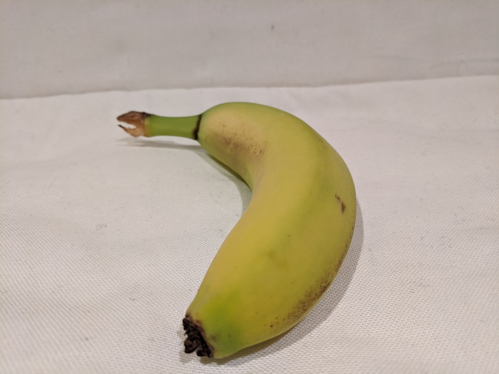

---
lab:
  title: Menjelajahi klasifikasi gambar
  module: Module 3 - Computer Vision
---

# <a name="explore-image-classification"></a>Menjelajahi klasifikasi gambar

> **Catatan** Untuk menyelesaikan lab ini, Anda memerlukan [langganan Azure](https://azure.microsoft.com/free?azure-portal=true) dengan akses administrator.

Layanan kognitif *Computer Vision* menyediakan model yang telah dibangun sebelumnya yang berguna untuk bekerja dengan gambar, tetapi Anda sering kali perlu melatih model Anda sendiri untuk computer vision. Misalnya, perusahaan ritel Northwind Traders ingin membuat sistem pembayaran otomatis yang mengidentifikasi barang belanjaan yang ingin dibeli pelanggan berdasarkan gambar yang diambil oleh kamera saat pembayaran. Untuk melakukan ini, Anda perlu melatih model klasifikasi yang dapat mengklasifikasikan gambar untuk mengidentifikasi item yang dibeli.

Di Azure, Anda dapat menggunakan layanan kognitif ***Custom Vision*** untuk melatih model klasifikasi gambar berdasarkan gambar yang ada. Ada dua elemen untuk membuat solusi klasifikasi gambar. Pertama, Anda harus melatih model untuk mengenali kelas yang berbeda menggunakan gambar yang ada. Kemudian, saat model dilatih, Anda harus menerbitkannya sebagai layanan yang dapat digunakan oleh aplikasi.

Untuk menguji kemampuan layanan Custom Vision, kita akan menggunakan aplikasi baris perintah sederhana yang berjalan di Cloud Shell. Prinsip dan fungsionalitas yang sama berlaku dalam solusi dunia nyata, seperti situs web atau aplikasi telepon.

## <a name="create-a-cognitive-services-resource"></a>Buat sumber daya *Cognitive Services*

Anda dapat menggunakan layanan Custom Vision dengan membuat sumber daya **Custom Vision** atau sumber daya **Cognitive Services**.

>**Catatan** Tidak semua sumber daya tersedia di setiap wilayah. Baik Anda membuat sumber daya Custom Vision atau Cognitive Services, hanya sumber daya yang dibuat di [wilayah tertentu](https://azure.microsoft.com/global-infrastructure/services/?products=cognitive-services) yang dapat digunakan untuk mengakses layanan Custom Vision. Demi kemudahan, wilayah telah dipilih sebelumnya untuk Anda dalam instruksi konfigurasi di bawah ini.

Buat sumber daya **Cognitive Services** di langganan Azure Anda.

1. Di tab browser lain, buka portal Microsoft Azure di [https://portal.azure.com](https://portal.azure.com?azure-portal=true), masuk dengan akun Microsoft Anda.

1. Klik tombol **&#65291;Buat sumber daya**, cari *Cognitive Services*, dan buat sumber daya **Cognitive Services** dengan pengaturan berikut:
    - **Langganan**: *Langganan Azure Anda*.
    - **Grup sumber daya**: *Pilih atau buat grup sumber daya dengan nama unik*.
    - **Wilayah**: US Timur
    - **Nama**: *Masukkan nama unik*.
    - **Tingkat harga**: Standar S0
    - **Dengan mencentang kotak ini, saya menyatakan bahwa saya telah membaca dan memahami semua persyaratan di bawah**: Dipilih.

1. Tinjau dan buat sumber daya, dan tunggu hingga penyebaran selesai. Lalu pergi ke sumber daya yang disebarkan.

1. Lihat halaman **Kunci dan Titik Akhir** untuk sumber daya Cognitive Services Anda. Anda akan memerlukan titik akhir dan kunci untuk terhubung dari aplikasi klien.

## <a name="create-a-custom-vision-project"></a>Membuat proyek Visual Kustom

Untuk melatih model deteksi objek, Anda perlu membuat proyek Custom Vision berdasarkan sumber daya pelatihan. Untuk melakukannya, Anda akan menggunakan portal Custom Vision.

1. Unduh dan ekstrak gambar pelatihan dari https://aka.ms/fruit-images. Gambar-gambar ini disediakan dalam folder zip, yang jika diekstrak berisi subfolder yang disebut **apel**, **pisang**, dan **jeruk**.

1. Di tab browser lain, buka portal Custom Vision di [https://customvision.ai](https://customvision.ai?azure-portal=true). Jika diminta, masuk menggunakan akun Microsoft yang terkait dengan langganan Azure Anda dan setujui ketentuan layanan.

1. Di portal Custom Vision, buat proyek baru dengan pengaturan berikut:

    - **Nama**: Pembayaran Belanjaan
    - **Deskripsi**: Klasifikasi gambar untuk belanjaan
    - **Sumber daya**: *Sumber daya Custom Vision yang Anda buat sebelumnya*
    - **Jenis Proyek**: Klasifikasi
    - **Jenis Klasifikasi**: Multikelas (Tag tunggal per gambar)
    - **Domain**: Makanan

1. Klik **Tambahkan gambar**, dan pilih semua file di folder **apel** yang Anda ekstrak sebelumnya. Kemudian unggah file gambar, tentukan tag *apel*, seperti ini:

    

1. Ulangi langkah sebelumnya untuk mengunggah gambar di folder **pisang** dengan tag *pisang*, dan gambar di folder **jeruk** dengan tag *jeruk*.

1. Jelajahi gambar yang telah Anda unggah di proyek Custom Vision - harus ada 15 gambar dari setiap kelas, seperti ini:

    

1. Dalam proyek Custom Vision, di atas gambar, klik **Latih** untuk melatih model klasifikasi menggunakan gambar yang diberi tag. Pilih opsi **Pelatihan Cepat**, lalu tunggu hingga perulangan pelatihan selesai (hal ini mungkin memerlukan waktu sekitar satu menit).

1. Ketika perulangan model telah dilatih, tinjau metrik performa *Presisi*, *Pengenalan*, dan *AP* - hal ini mengukur akurasi prediksi model klasifikasi, dan semua harus tinggi.

## <a name="test-the-model"></a>Menguji model

Sebelum menerbitkan perulangan model ini untuk digunakan aplikasi, Anda harus mengujinya.

1. Di atas metrik performa, klik **Uji Cepat**.

1. Di kotak **URL Gambar**, ketik `https://aka.ms/apple-image` dan klik &#10132;

1. Lihat prediksi yang ditampilkan oleh model Anda - skor peluang untuk *apel* harus yang tertinggi, seperti ini:

    

1. Tutup jendela **Uji Cepat**.

## <a name="publish-the-image-classification-model"></a>Terbitkan model klasifikasi gambar

Sekarang Anda siap untuk menerbitkan model terlatih dan menggunakannya dari aplikasi klien.

1. Klik **&#128504; Terbitkan** untuk menerbitkan model terlatih dengan pengaturan berikut:
    - **Nama model**: belanjaan
    - **Sumber Daya Prediksi**: *Sumber daya prediksi yang Anda buat sebelumnya*.

1. Setelah menerbitkan, klik ikon *URL Prediksi* (&#127760;) untuk melihat informasi yang diperlukan untuk menggunakan model yang diterbitkan. Nanti, Anda akan memerlukan URL yang sesuai dan nilai-nilai Kunci Prediksi untuk mendapatkan prediksi dari URL Gambar, jadi biarkan kotak dialog ini tetap terbuka dan lanjutkan ke tugas berikutnya. 

## <a name="run-cloud-shell"></a>Jalankan Cloud Shell

Untuk menguji kemampuan layanan Custom Vision, kami akan menggunakan aplikasi baris perintah sederhana yang berjalan di Cloud Shell di Azure.

1. Di portal Microsoft Azure, pilih tombol **[>_]** (*Cloud Shell*) di bagian atas halaman di sebelah kanan kotak pencarian. Tindakan ini akan membuka panel Cloud Shell di bagian bawah portal. 

    

1. Saat pertama kali membuka Cloud Shell, Anda mungkin diminta untuk memilih jenis shell yang ingin digunakan (*Bash* atau *PowerShell*). Pilih **PowerShell**. Jika Anda tidak melihat opsi ini, lewati langkah ini.  

1. Jika Anda diminta membuat penyimpanan untuk Cloud Shell, pastikan langganan ditentukan dan pilih **Buat penyimpanan**. Kemudian tunggu sekitar satu menit hingga penyimpanan dibuat.

    [](media/create-image-classification-system/powershell-portal-guide-2.png#lightbox)

1. Pastikan jenis shell yang ditunjukkan di kiri atas panel Cloud Shell dialihkan ke *PowerShell*. Jika *Bash*, alihkan ke *PowerShell* dengan menggunakan menu drop-down.

    

1. Tunggu PowerShell untuk memulai. Anda akan melihat layar berikut di portal Microsoft Azure:  

    

## <a name="configure-and-run-a-client-application"></a>Konfigurasi dan jalankan aplikasi klien

Setelah memiliki lingkungan Cloud Shell, Anda dapat menjalankan aplikasi sederhana yang menggunakan layanan Custom Vision untuk menganalisis gambar.

1. Di shell perintah, masukkan perintah berikut untuk mengunduh aplikasi contoh dan menyimpannya ke folder bernama ai-900. 

    ```PowerShell
    git clone https://github.com/MicrosoftLearning/AI-900-AIFundamentals ai-900
    ```

    >**Tips** Jika Anda telah menggunakan perintah ini di lab lain untuk menggandakan penyimpanan *ai-900*, Anda dapat melewati langkah ini.

1. File diunduh ke folder bernama **ai-900**. Sekarang kami ingin melihat semua file di penyimpanan Cloud Shell Anda dan menggunakannya. Ketik perintah berikut ke dalam shell:

    ```PowerShell
    code .
    ```

    Perhatikan bagaimana perintah ini membuka penyunting seperti pada gambar di bawah ini: 

    

1. Di panel **File** di sebelah kiri, luaskan **ai-900** dan pilih **classify-image.ps1**. File ini berisi beberapa kode yang menggunakan model Custom Vision untuk menganalisis gambar, seperti yang ditunjukkan di sini:

     

1. Jangan terlalu khawatir tentang detail kode, yang penting kode tersebut memerlukan URL prediksi dan kunci untuk model Custom Vision Anda saat menggunakan URL gambar. 

   Dapatkan *URL prediksi* dari kotak dialog dalam proyek Custom Vision. 

   >**Catatan** Ingat, Anda sudah meninjau *URL prediksi* setelah menerbitkan model klasifikasi gambar. Untuk menemukan *URL prediksi*, buka tab **Performa** di proyek Anda, lalu klik **URL Prediksi** (jika layar dikompresi, Anda mungkin hanya melihat ikon bola bumi). Kotak dialog akan muncul. Salin url untuk **Jika Anda memiliki URL gambar**. Tempelkan ke dalam penyunting kode, dengan mengganti **YOUR_PREDICTION_URL**.

    Dengan menggunakan kotak dialog yang sama, dapatkan *kunci prediksi*. Salin kunci prediksi yang ditampilkan setelah *Mengatur Header Kunci-Prediksi ke*. Tempel di penyunting kode, menggantikan nilai tempat penampung **YOUR_PREDICTION_KEY**.

    

    Setelah menempelkan nilai URL Prediksi dan Kunci Prediksi, dua baris kode pertama akan terlihat seperti ini:

    ```PowerShell
    $predictionUrl="https..."
    $predictionKey ="1a2b3c4d5e6f7g8h9i0j...."
    ```

1. Di kanan atas panel penyunting, gunakan tombol **...** untuk membuka menu dan pilih **Simpan** untuk menyimpan perubahan Anda. Kemudian buka lagi menu dan pilih **Tutup Penyunting**.

    Anda akan menggunakan aplikasi klien sampel untuk mengklasifikasikan beberapa gambar ke dalam kategori apel, pisang, atau jeruk.

1. Kita akan mengklasifikasikan gambar ini:

    

    Di panel PowerShell, masukkan perintah berikut untuk menjalankan kode:

    ```PowerShell
    cd ai-900
    ./classify-image.ps1 1
    ```

1. Tinjau prediksi, yang seharusnya **apel**.

1. Sekarang mari kita coba gambar lain:

    

    Jalankan perintah ini:

    ```PowerShell
    ./classify-image.ps1 2
    ```

1. Pastikan model mengklasifikasikan gambar ini sebagai **pisang**.

1. Akhirnya, mari kita coba gambar pengujian ketiga:

    

    Jalankan perintah ini:

    ```PowerShell
    ./classify-image.ps1 3
    ```

1. Pastikan model mengklasifikasikan gambar ini sebagai **jeruk**.

## <a name="learn-more"></a>Pelajari lebih lanjut

Aplikasi sederhana ini hanya menunjukkan beberapa kemampuan layanan Custom Vision. Untuk mempelajari selengkapnya tentang apa yang dapat Anda lakukan dengan layanan ini, lihat [halaman Custom Vision](https://azure.microsoft.com/services/cognitive-services/custom-vision-service/).
