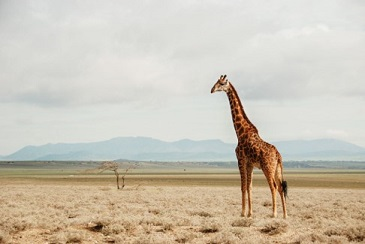

---
lab:
  title: Menjelajahi klasifikasi gambar
---

# Menjelajahi klasifikasi gambar

Layanan *Azure AI Vision* menyediakan model bawaan yang berguna untuk bekerja dengan gambar, tetapi Anda sering kali perlu melatih model Anda sendiri untuk visi komputer. Misalnya, organisasi konservasi satwa liar ingin melacak penampakan hewan dengan menggunakan kamera sensitif gerakan. Gambar yang diambil oleh kamera kemudian dapat digunakan untuk memverifikasi keberadaan spesies tertentu di area tertentu dan membantu upaya konservasi untuk spesies yang terancam punah. Untuk mencapai hal ini, organisasi akan mendapat manfaat dari model *klasifikasi gambar* yang dilatih untuk mengidentifikasi berbagai spesies hewan dalam foto yang ditangkap.

Di Azure, Anda dapat menggunakan layanan ***Custom Vision*** untuk melatih model klasifikasi gambar berdasarkan gambar yang ada. Ada dua elemen untuk membuat solusi klasifikasi gambar. Pertama, Anda harus melatih model untuk mengenali kelas yang berbeda menggunakan gambar yang ada. Kemudian, saat model dilatih, Anda harus menerbitkannya sebagai layanan yang dapat digunakan oleh aplikasi.

Untuk menguji kemampuan layanan Custom Vision, kita akan menggunakan aplikasi baris perintah sederhana yang berjalan di Cloud Shell. Prinsip dan fungsionalitas yang sama berlaku dalam solusi dunia nyata, seperti situs web atau aplikasi seluler.

## Sebelum memulai

Untuk menyelesaikan lab ini, Anda memerlukan [langganan Azure](https://azure.microsoft.com/free?azure-portal=true) tempat Anda memiliki akses administratif.

## Membuat sumber daya *layanan Azure AI*

Anda dapat menggunakan layanan Custom Vision dengan membuat sumber daya **Custom Vision** atau sumber daya **layanan Azure AI**.

>**Catatan** Tidak semua sumber daya tersedia di setiap wilayah. Baik Anda membuat Custom Vision atau sumber daya layanan Azure AI, hanya sumber daya yang dibuat di [wilayah tertentu yang](https://azure.microsoft.com/global-infrastructure/services/?products=cognitive-services) dapat digunakan untuk mengakses layanan Custom Vision. Demi kemudahan, wilayah telah dipilih sebelumnya untuk Anda dalam instruksi konfigurasi di bawah ini.

Buat sumber daya **layanan Azure AI** di langganan Azure Anda.

1. Buka portal Azure di [https://portal.azure.com](https://portal.azure.com?azure-portal=true), masuk dengan akun Microsoft Anda.

1. Klik tombol **&#65291;Buat sumber daya** dan cari *layanan Azure AI*. Pilih **buat** paket **layanan Azure AI** . Anda akan dibawa ke halaman untuk membuat sumber daya layanan Azure AI. Konfigurasikan dengan pengaturan berikut:
    - **Langganan**: *Langganan Azure Anda*.
    - **Grup sumber daya**: *Pilih atau buat grup sumber daya dengan nama unik*.
    - **Wilayah**: US Timur
    - **Nama**: *Masukkan nama unik*.
    - **Tingkat harga**: Standar S0
    - **Dengan mencentang kotak ini, saya menyatakan bahwa saya telah membaca dan memahami semua persyaratan di bawah**: Dipilih.

1. Tinjau dan buat sumber daya, dan tunggu hingga penyebaran selesai. Lalu pergi ke sumber daya yang disebarkan.

1. Lihat halaman **Kunci dan Titik Akhir** untuk sumber daya layanan Azure AI Anda. Anda akan memerlukan titik akhir dan kunci untuk terhubung dari aplikasi klien.

## Membuat proyek Visual Kustom

Untuk melatih model deteksi objek, Anda perlu membuat proyek Custom Vision berdasarkan sumber daya pelatihan. Untuk melakukannya, Anda akan menggunakan portal Custom Vision.

1. Unduh dan ekstrak gambar pelatihan dari [https://aka.ms/animal-images](https://aka.ms/animal-images). Gambar-gambar ini disediakan dalam folder zip, yang ketika diekstrak berisi subfolder yang disebut **gajah**, **jerapah**, dan **singa**.

1. Buka tab browser baru, dan telusuri ke portal Custom Vision di [https://customvision.ai](https://customvision.ai?azure-portal=true). Jika diminta, masuk menggunakan akun Microsoft yang terkait dengan langganan Azure Anda dan setujui ketentuan layanan.

1. Di portal Custom Vision, buat proyek baru dengan pengaturan berikut:

    - **Nama**: Identifikasi Hewan
    - **Deskripsi**: Klasifikasi gambar untuk hewan
    - **Sumber daya**: *Layanan Azure AI atau sumber daya Custom Vision yang Anda buat sebelumnya*
    - **Jenis Proyek**: Klasifikasi
    - **Jenis Klasifikasi**: Multikelas (Tag tunggal per gambar)
    - **Domain**: Umum \[A2]

1. Klik **Tambahkan gambar**, dan pilih semua file di folder **gajah** yang Anda ekstrak sebelumnya. Kemudian unggah file gambar, yang menentukan tag *gajah*, seperti ini:

    

1. Gunakan tombol **Tambahkan gambar** ([+]) untuk mengunggah gambar di folder **jerak** dengan *jembut* tag, dan gambar di folder **singa** dengan *singa* tag.

1. Jelajahi gambar yang telah Anda unggah dalam proyek Custom Vision - harus ada 17 gambar dari setiap kelas, seperti ini:

    

1. Dalam proyek Custom Vision, di atas gambar, klik **Latih** untuk melatih model klasifikasi menggunakan gambar yang diberi tag. Pilih opsi **Pelatihan Cepat** , lalu tunggu hingga iterasi pelatihan selesai.

    > **Tips**: Pelatihan mungkin memakan waktu beberapa menit. Sambil menunggu, lihat [Bagaimana selfie macan tutul salju dan AI dapat membantu menyelamatkan spesies dari kepunahan](https://news.microsoft.com/transform/snow-leopard-selfies-ai-save-species/), yang menggambarkan proyek nyata yang menggunakan visi komputer untuk melacak hewan yang terancam punah di alam liar.

1. Ketika perulangan model telah dilatih, tinjau metrik performa *Presisi*, *Pengenalan*, dan *AP* - hal ini mengukur akurasi prediksi model klasifikasi, dan semua harus tinggi.

## Menguji model

Sebelum menerbitkan perulangan model ini untuk digunakan aplikasi, Anda harus mengujinya.

1. Di atas metrik performa, klik **Uji Cepat**.

1. Dalam kotak **URL Gambar**, ketik `https://aka.ms/giraffe` dan klik tombol **uji gambar cepat (&#10132;).**

1. Lihat prediksi yang dikembalikan oleh model Anda - skor probabilitas untuk *jerapah* harus tertinggi, seperti ini:

    

1. Tutup jendela **Uji Cepat**.

## Terbitkan model klasifikasi gambar

Sekarang Anda siap untuk menerbitkan model terlatih dan menggunakannya dari aplikasi klien.

1. Klik **&#128504; Terbitkan** untuk menerbitkan model terlatih dengan pengaturan berikut:
    - **Nama model**: hewan
    - **Sumber Daya Prediksi**: *Layanan Azure AI atau sumber daya prediksi Custom Vision yang Anda buat sebelumnya*.

1. Setelah menerbitkan, klik ikon *URL Prediksi* (&#127760;) untuk melihat informasi yang diperlukan untuk menggunakan model yang diterbitkan.

    

Nanti, Anda akan memerlukan URL yang sesuai dan nilai-nilai Kunci Prediksi untuk mendapatkan prediksi dari URL Gambar, jadi biarkan kotak dialog ini tetap terbuka dan lanjutkan ke tugas berikutnya.

## Menyiapkan aplikasi klien

Untuk menguji kemampuan layanan Custom Vision, kita akan menggunakan aplikasi baris perintah sederhana yang berjalan di cloud shell di Azure.

1. Beralih kembali ke tab browser yang berisi portal Azure, dan pilih tombol **Cloud shell** (**[>_]**) di bagian atas halaman di sebelah kanan kotak pencarian. Ini membuka panel cloud shell di bagian bawah portal.

    Saat pertama kali membuka Cloud Shell, Anda mungkin diminta untuk memilih jenis shell yang ingin digunakan (*Bash* atau *PowerShell*). Jika demikian, pilih **PowerShell**.

    Jika Anda diminta untuk membuat penyimpanan untuk Cloud Shell Anda, pastikan langganan Anda dipilih dan pilih **Buat penyimpanan**. Kemudian tunggu sekitar satu menit hingga penyimpanan dibuat.

    Ketika cloud shell siap, cloud shell akan terlihat mirip dengan ini:
    
    

    > **Tips**: Pastikan bahwa jenis shell yang ditunjukkan di kiri atas panel Cloud Shell adalah *PowerShell*. Jika *Bash*, alihkan ke *PowerShell* dengan menggunakan menu drop-down.

    Perhatikan bahwa Anda dapat mengubah ukuran cloud shell dengan menyeret bilah pemisah di bagian atas panel, atau menggunakan ikon **&#8212;** , **&#9723;** , dan **X** di kanan atas panel untuk meminimalkan, memaksimalkan, dan menutup panel. Untuk informasi selengkapnya tentang menggunakan Azure Cloud Shell, lihat [dokumentasi Azure Cloud Shell](https://docs.microsoft.com/azure/cloud-shell/overview).

2. Di shell perintah, masukkan perintah berikut untuk mengunduh file untuk latihan ini dan simpan dalam folder bernama **ai-900** (setelah menghapus folder tersebut jika sudah ada)

    ```PowerShell
    rm -r ai-900 -f
    git clone https://github.com/MicrosoftLearning/AI-900-AIFundamentals ai-900
    ```

3. Setelah file diunduh, masukkan perintah berikut untuk mengubah ke direktori **ai-900** dan edit file kode untuk latihan ini:

    ```PowerShell
    cd ai-900
    code classify-image.ps1
    ```

    Perhatikan bagaimana ini membuka editor seperti pada gambar di bawah ini:

     

     > **Tips**: Anda dapat menggunakan bilah pemisah antara baris perintah cloud shell dan editor kode untuk mengubah ukuran panel.

4. Jangan terlalu memikirkan detail kode. Yang penting adalah dimulai dengan beberapa kode untuk menentukan URL prediksi dan kunci untuk model Custom Vision Anda. Anda harus memperbaruinya sehingga kode lainnya menggunakan model Anda.

    Dapatkan *URL prediksi* dan *kunci prediksi* dari kotak dialog yang Anda tinggalkan terbuka di tab browser untuk proyek Custom Vision Anda. **Anda memerlukan versi yang akan digunakan *jika Anda memiliki URL gambar*.**

    Gunakan nilai-nilai ini untuk mengganti tempat penampung **YOUR_PREDICTION_URL** dan **YOUR_PREDICTION_KEY** dalam file kode.

    Setelah menempelkan nilai URL Prediksi dan Kunci Prediksi, dua baris kode pertama akan terlihat seperti ini:

    ```PowerShell
    $predictionUrl="https..."
    $predictionKey ="1a2b3c4d5e6f7g8h9i0j...."
    ```

5. Setelah membuat perubahan pada variabel dalam kode, tekan **CTRL+S** untuk menyimpan file. Lalu tekan **CTRL+Q** untuk menutup editor kode.

## Menguji aplikasi klien

Sekarang Anda dapat menggunakan aplikasi klien sampel untuk mengklasifikasikan gambar berdasarkan hewan yang dikandungnya.

1. Di panel PowerShell, masukkan perintah berikut untuk menjalankan kode:

    ```PowerShell
    ./classify-image.ps1 1
    ```

    Kode ini menggunakan model Anda untuk mengklasifikasikan gambar berikut:

    

1. Tinjau prediksi, yang seharusnya **jerawat**.

1. Sekarang mari kita coba gambar lain. Jalankan perintah ini:

    ```PowerShell
    ./classify-image.ps1 2
    ```

    Kali ini gambar berikut diklasifikasikan:

    

1. Verifikasi bahwa model mengklasifikasikan gambar ini sebagai **gajah**.

1. Mari kita coba satu lagi. Jalankan perintah ini:

    ```PowerShell
    ./classify-image.ps1 3
    ```

    Gambar akhir terlihat seperti ini:

    

1. Verifikasi bahwa model mengklasifikasikan gambar ini sebagai **singa**.

Mudah-mudahan, model klasifikasi gambar Anda mengklasifikasikan ketiga gambar dengan benar.


