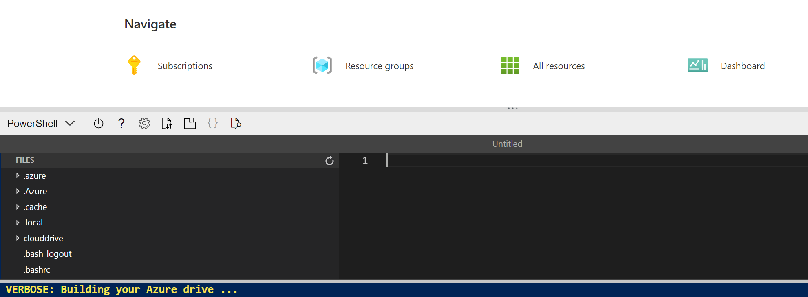
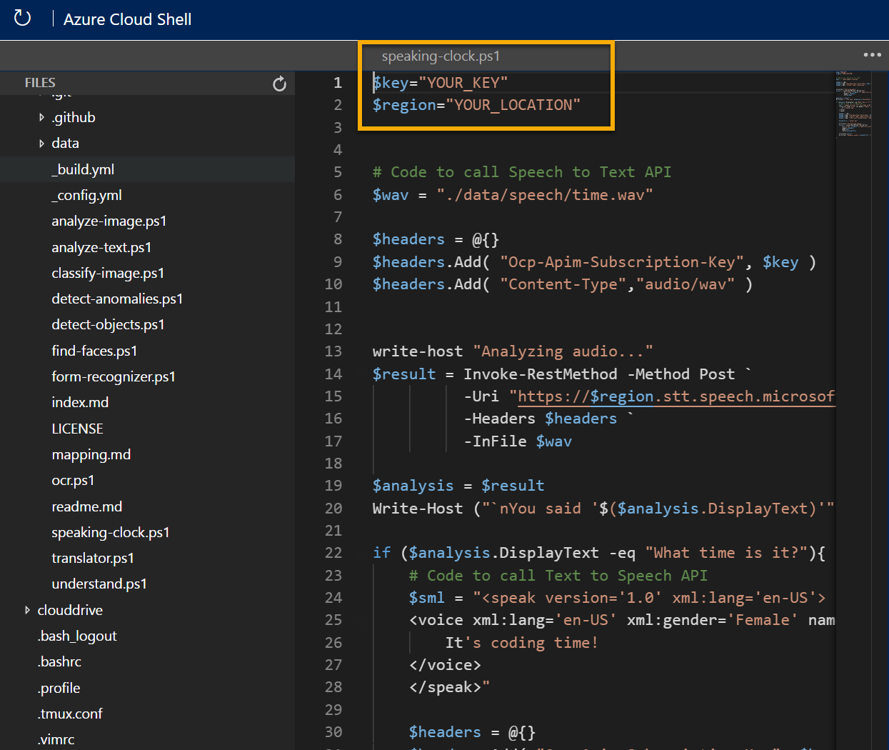

---
lab:
  title: Menjelajahi ucapan
---

# <a name="explore-speech"></a>Menjelajahi ucapan

> **Catatan** Untuk menyelesaikan lab ini, Anda memerlukan [langganan Azure](https://azure.microsoft.com/free?azure-portal=true) dengan akses administrator.

Untuk membangun perangkat lunak yang dapat menafsirkan ucapan yang dapat didengar dan merespons dengan tepat, Anda dapat menggunakan layanan kognitif **Ucapan**, yang menyediakan cara sederhana untuk mentranskripsikan bahasa lisan ke dalam teks dan sebaliknya.

Misalnya, Anda ingin membuat perangkat pintar yang dapat merespons pertanyaan lisan secara lisan, seperti "Jam berapa sekarang?" Responsnya harus waktu setempat.

Untuk menguji kemampuan layanan Ucapan, kami akan menggunakan aplikasi baris perintah sederhana yang berjalan di Cloud Shell. Prinsip dan fungsionalitas yang sama berlaku dalam solusi dunia nyata, seperti situs web atau aplikasi telepon.

## <a name="create-a-cognitive-services-resource"></a>Buat sumber daya *Cognitive Services*

Anda dapat menggunakan layanan Ucapan dengan membuat sumber daya **Ucapan** atau sumber daya **Cognitive Services**.

Jika belum melakukannya, buat sumber daya **Cognitive Services** di langganan Azure Anda.

1. Di tab browser lain, buka portal Microsoft Azure di [https://portal.azure.com](https://portal.azure.com?azure-portal=true), masuk dengan akun Microsoft Anda.

1. Klik tombol **&#65291;Buat sumber daya**, cari *Cognitive Services*, dan buat sumber daya **Cognitive Services** dengan pengaturan berikut:
    - **Langganan**: *Langganan Azure Anda*.
    - **Grup sumber daya**: *Pilih atau buat grup sumber daya dengan nama unik*.
    - **Wilayah**: *Pilih wilayah yang tersedia*.
    - **Nama**: *Masukkan nama unik*.
    - **Tingkat harga**: Standar S0
    - **Dengan mencentang kotak ini, saya menyatakan bahwa saya telah membaca dan memahami semua persyaratan di bawah**: Dipilih.

1. Tinjau dan buat sumber daya.

### <a name="get-the-key-and-location-for-your-cognitive-services-resource"></a>Mendapatkan Kunci dan Lokasi untuk sumber daya Cognitive Services Anda

1. Tunggu hingga penerapan selesai. Kemudian buka sumber daya Cognitive Services Anda, dan pada halaman **Gambaran umum**, klik tautan untuk mengelola kunci layanan. Anda akan memerlukan titik akhir dan kunci untuk terhubung ke sumber daya Cognitive Services dari aplikasi klien.

1. Lihat halaman **Kunci dan Titik Akhir** untuk sumber daya Anda. Anda memerlukan **lokasi/wilayah** dan **kunci** untuk terhubung dari aplikasi klien.

## <a name="run-cloud-shell"></a>Jalankan Cloud Shell

Untuk menguji kemampuan layanan Ucapan, kita akan menggunakan aplikasi baris perintah sederhana yang berjalan di Cloud Shell di Azure.

1. Di portal Microsoft Azure, pilih tombol **[>_]** (*Cloud Shell*) di bagian atas halaman di sebelah kanan kotak pencarian. Tindakan ini akan membuka panel Cloud Shell di bagian bawah portal.

    

1. Saat pertama kali membuka Cloud Shell, Anda mungkin diminta untuk memilih jenis shell yang ingin digunakan (*Bash* atau *PowerShell*). Pilih **PowerShell**. Jika Anda tidak melihat opsi ini, lewati langkah ini.  

1. Jika Anda diminta membuat penyimpanan untuk Cloud Shell, pastikan langganan ditentukan dan pilih **Buat penyimpanan**. Kemudian tunggu sekitar satu menit hingga penyimpanan dibuat.

    

1. Pastikan jenis shell yang ditunjukkan di kiri atas panel Cloud Shell dialihkan ke *PowerShell*. Jika *Bash*, alihkan ke *PowerShell* dengan menggunakan menu drop-down.

    

1. Tunggu PowerShell untuk memulai. Anda akan melihat layar berikut di portal Microsoft Azure:  

    

## <a name="configure-and-run-a-client-application"></a>Konfigurasi dan jalankan aplikasi klien

Sekarang setelah memiliki model kustom, Anda dapat menjalankan aplikasi klien sederhana yang menggunakan layanan Ucapan.

1. Di shell perintah, masukkan perintah berikut untuk mengunduh aplikasi contoh dan menyimpannya ke folder bernama ai-900.

    ```PowerShell
    git clone https://github.com/MicrosoftLearning/AI-900-AIFundamentals ai-900
    ```

    >**Tips** Jika Anda telah menggunakan perintah ini di lab lain untuk menggandakan penyimpanan *ai-900*, Anda dapat melewati langkah ini.

1. File diunduh ke folder bernama **ai-900**. Sekarang kami ingin melihat semua file di penyimpanan Cloud Shell Anda dan menggunakannya. Ketik perintah berikut ke dalam shell:

     ```PowerShell
    code .
    ```

    Perhatikan bagaimana perintah ini membuka penyunting seperti pada gambar di bawah ini:

    

1. Di panel **File** di sebelah kiri, luaskan **ai-900** dan pilih **speaking-clock.ps1**. File ini berisi beberapa kode yang menggunakan layanan Ucapan untuk mengenali dan mensintesis ucapan:

    

1. Jangan terlalu khawatir tentang detail kode, yang penting kode tersebut membutuhkan wilayah/lokasi dan salah satu kunci untuk sumber daya Cognitive Services Anda. Salin ini dari halaman **Kunci dan Titik Akhir** untuk sumber daya Anda dari portal Microsoft Azure dan tempel ke penyunting kode, menggantikan nilai tempat penampung **YOUR_KEY** dan **YOUR_LOCATION** masing-masing.

    > **Tips** Anda mungkin perlu menggunakan bilah pemisah untuk menyesuaikan area layar saat bekerja dengan panel **Tombol dan Titik Akhir** serta **Editor**.

    Setelah menempelkan nilai kunci dan wilayah/lokasi, baris kode pertama akan terlihat seperti ini:

    ```PowerShell
    $key = "1a2b3c4d5e6f7g8h9i0j...."
    $region="somelocation"
    ```

1. Di kanan atas panel penyunting, gunakan tombol **...** untuk membuka menu dan pilih **Simpan** untuk menyimpan perubahan Anda. Kemudian buka lagi menu dan pilih **Tutup Penyunting**.

    Aplikasi klien sampel akan menggunakan layanan Ucapan Anda untuk mentranskripsikan input lisan dan mensintesis respons lisan yang sesuai. Aplikasi nyata akan menerima input dari mikrofon dan mengirim respons ke speaker, tetapi dalam contoh sederhana ini, kita akan menggunakan input yang telah direkam sebelumnya dalam file dan menyimpan respons sebagai file lain.

    Gunakan pemutar video di bawah ini untuk mendengarkan audio input yang akan diproses aplikasi:

    <div class="embeddedvideo"><iframe src="https://www.microsoft.com/videoplayer/embed/RWMAvi" frameborder="0" allowfullscreen="true" data-linktype="external"></iframe></div>

1. Di panel PowerShell, masukkan perintah berikut untuk menjalankan kode:

    ```PowerShell
    cd ai-900
    ./speaking-clock.ps1
    ```

1. Tinjau output, yang seharusnya berhasil mengenali teks "Jam berapa sekarang?" dan simpan respons yang sesuai dalam file bernama *output.wav*.

    Gunakan pemutar video berikut untuk mendengar output lisan yang dihasilkan oleh aplikasi:

    <div class="embeddedvideo"><iframe src="https://www.microsoft.com/videoplayer/embed/RWMSIU" frameborder="0" allowfullscreen="true" data-linktype="external"></iframe></div>

## <a name="learn-more"></a>Pelajari lebih lanjut

Aplikasi sederhana ini hanya menunjukkan beberapa kemampuan layanan Ucapan. Untuk mempelajari selengkapnya tentang apa yang dapat Anda lakukan dengan layanan ini, lihat [halaman Ucapan](https://azure.microsoft.com/services/cognitive-services/speech-services/).
