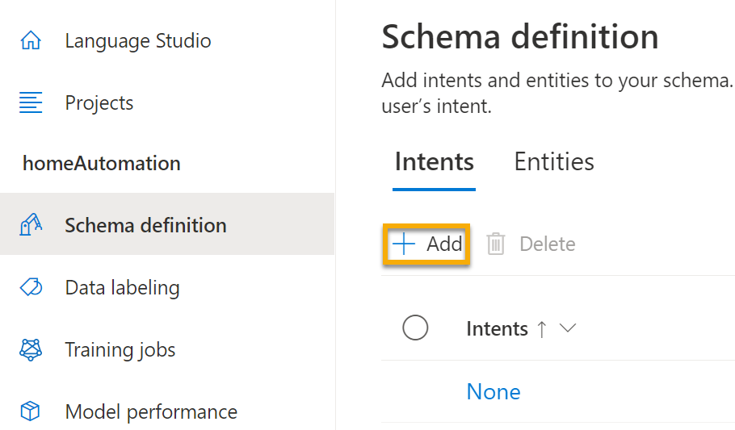
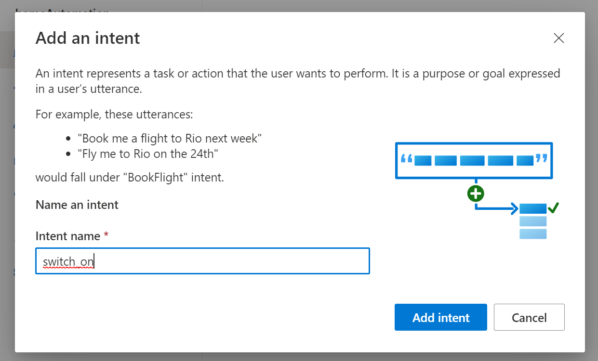
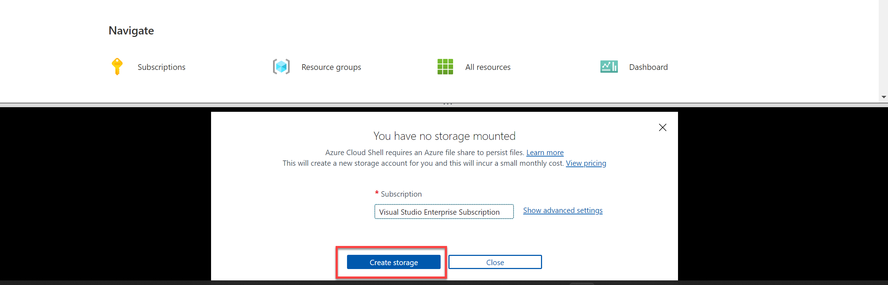

---
lab:
  title: Menjelajahi pemahaman bahasa
  module: Module 4 - Natural Language Processing (NLP)
---

# <a name="explore-language-understanding"></a>Menjelajahi pemahaman bahasa

> **Catatan** Untuk menyelesaikan lab ini, Anda memerlukan [langganan Azure](https://azure.microsoft.com/free?azure-portal=true) dengan akses administrator.

Kami semakin berharap bahwa komputer dapat menggunakan AI untuk memahami perintah lisan atau ketik dalam bahasa alami. Misalnya, Anda mungkin ingin menerapkan sistem otomatisasi rumah yang memungkinkan Anda mengontrol perangkat di rumah menggunakan perintah suara seperti "nyalakan lampu" atau "hidupkan kipas", dan meminta perangkat yang didukung AI memahami perintah dan mengambil tindakan yang tepat.

Untuk menguji kemampuan layanan Pemahaman Bahasa Percakapan, kami akan menggunakan aplikasi baris perintah yang berjalan di Cloud Shell. Prinsip dan fungsi yang sama berlaku dalam solusi dunia nyata, seperti situs web atau aplikasi ponsel.

## <a name="create-a-language-service-resource"></a>Buat sumber daya *Layanan bahasa*

Anda dapat menggunakan layanan Pemahaman Bahasa Percakapan dengan membuat sumber daya **Layanan bahasa**.

Jika Anda belum melakukannya, buat sumber daya **Layanan bahasa** di langganan Azure Anda.

1. Di tab browser lain, buka portal Microsoft Azure di [https://portal.azure.com](https://portal.azure.com?azure-portal=true), masuk dengan akun Microsoft Anda.

1. Klik tombol **&#65291;Buat sumber daya**, cari *Layanan bahasa*, dan buat sumber daya **Layanan bahasa** dengan pengaturan berikut:
    - Pilih fitur tambahan: *Pertahankan fitur default dan klik Lanjutkan untuk membuat sumber daya Anda*  
    - **Langganan**: *Langganan Azure Anda*.
    - **Grup sumber daya**: *Pilih atau buat grup sumber daya dengan nama unik*.
    - **Wilayah**: US Timur 2
    - **Nama**: *Masukkan nama unik*.
    - **Tingkat harga**: S (1K Panggilan per menit)
    - **Dengan mencentang kotak ini, saya menyatakan bahwa saya telah meninjau dan menyetujui persyaratan dalam Pemberitahuan AI yang Bertanggung Jawab.** : Dipilih.

1. Tinjau dan buat sumber daya, dan tunggu hingga penyebaran selesai.

### <a name="create-a-conversational-language-understanding-app"></a>Membuat Aplikasi Pemahaman Bahasa Percakapan

Untuk menerapkan pemahaman bahasa alami dengan Pemahaman Bahasa Percakapan, Anda membuat aplikasi; lalu tambahkan entitas, niat, dan ucapan untuk menentukan perintah yang Anda inginkan agar dijalankan oleh aplikasi.

1. Di tab browser baru, buka portal Language Studio di [https://language.azure.com](https://language.azure.com?azure-portal=true) dan masuk menggunakan akun Microsoft yang terkait dengan langganan Azure Anda.

1. Jika diminta untuk memilih sumber daya Bahasa, pilih pengaturan berikut:
    - **Direktori Azure**: Direktori Azure yang berisi langganan Anda.
    - **Langganan Azure**: Langganan Azure Anda.
    - **Sumber daya bahasa**: Sumber daya bahasa yang Anda buat sebelumnya.

    >**Tips** Jika ***tidak*** diminta untuk memilih sumber bahasa, mungkin karena Anda memiliki beberapa sumber Bahasa dalam langganan Anda; dalam hal ini:
    >1. Pada bilah di bagian atas halaman, klik tombol **Pengaturan (&#9881;)**.
    >1. Pada halaman **Pengaturan**, lihat tab **Sumber Daya**.
    >1. Pilih sumber daya bahasa Anda, dan klik **Ganti sumber daya**.
    >1. Di bagian atas halaman, klik **Language Studio** untuk kembali ke beranda Language Studio.

1. Di bagian atas portal, di menu **Buat baru**, pilih **Pemahaman bahasa percakapan**.

1. Dalam kotak dialog **Buat proyek**, pada halaman **Masukkan informasi dasar**, masukkan detail berikut ini dan klik **Berikutnya**:
    - **Nama**: *Membuat nama unik*
    - **Deskripsi**: Otomatisasi rumah sederhana
    - **Bahasa utama ucapan**: Bahasa Inggris
    - **Aktifkan beberapa bahasa dalam proyek:***Jangan pilih*

    

    >**Tips** Tulis *nama proyek*, Anda akan menggunakannya nanti.

1. Di halaman *Tinjau dan selesaikan*, klik **Buat**.

### <a name="create-intents-utterances-and-entities"></a>Membuat niat, ucapan, dan entitas

*Tujuan* adalah tindakan yang ingin Anda lakukan - misalnya, Anda mungkin ingin menyalakan lampu, atau mematikan kipas. Dalam hal ini, Anda akan menentukan dua tujuan: satu untuk mengaktifkan perangkat, dan satu lagi untuk mematikan perangkat. Untuk setiap niat, Anda akan menentukan contoh *ungkapan* yang menunjukkan jenis bahasa yang digunakan untuk mengindikasikan maksud.

1. Di panel **Definisi skema**, pastikan bahwa **Niat** dipilih Kemudian klik **Tambahkan**, dan tambahkan niat dengan nama **switch_on** (dalam huruf kecil) dan klik **Tambahkan niat**.

    
    

1. Pilih niat **switch_on**. Panel akan membawa Anda ke halaman **Pelabelan data**. Di menu dropdown **Tujuan**, pilih **switch_on**. Di samping niat **switch_on**, ketik ucapan ***nyalakan lampu*** dan tekan **Enter** untuk mengirimkan ucapan ini ke daftar.

    

1. Layanan bahasa membutuhkan setidaknya lima contoh ucapan yang berbeda untuk setiap tujuan guna melatih model bahasa secara memadai. Tambahkan lima contoh ucapan lainnya ke niat **switch_on**:  
    - ***nyalakan kipas angin***
    - ***nyalakan kipas***
    - ***hidupkan lampu***
    - ***nyalakan lampu***
    - ***nyalakan kipas***

1. Pada panel **Beri label entitas untuk pelatihan** di sisi kanan layar, pilih **Label**, lalu pilih **Tambahkan entitas**. Ketik **perangkat** (dalam huruf kecil), pilih **Daftar** dan pilih **Tambahkan entitas**.

     
    

1. Pada ucapan ***nyalakan kipas angin***, sorot kata "kipas angin". Kemudian dalam daftar yang muncul, di kotak *Cari entitas* pilih **perangkat**.

    

1. Lakukan hal yang sama untuk semua ucapan. Beri label ucapan *kipas* atau *lampu* lainnya dengan entitas **perangkat**. Setelah selesai, verifikasi bahwa Anda memiliki ucapan berikut dan pastikan untuk memilih **Simpan perubahan**:

    | **tujuan** | **ucapan** | **entitas** |
    | --------------- | ------------------ | ------------------ |
    | switch_on   | Nyalakan kipas angin      | Perangkat - *pilih kipas* |
    | switch_on   | Nyalakan lampu    | Perangkat - *pilih lampu* |
    | switch_on   | Nyalakan lampu | Perangkat - *pilih lampu* |
    | switch_on   | Nyalakan kipas angin     | Perangkat - *pilih kipas* |
    | switch_on   | Nyalakan kipas angin   | Perangkat - *pilih kipas* |
    | switch_on   | Nyalakan lampu   | Perangkat - *pilih lampu* |

     

1. Di panel di sebelah kiri, klik **Definisi skema** dan verifikasi bahwa niat **switch_on** Anda terdaftar. Lalu klik **Tambahkan** dan tambahkan niat baru dengan nama **switch_off** (dengan huruf kecil).

     

1. Klik niat **switch_off**. Panel akan membawa Anda ke halaman **Pelabelan data**. Di menu dropdown **Tujuan**, pilih **switch_off**. Di samping niat **switch_off**, tambahkan ucapan ***matikan lampu***.

1. Tambahkan empat contoh ucapan lainnya ke niat **switch_off**.
    - ***matikan kipas angin***
    - ***nonaktifkan kipas***
    - ***matikan lampu***
    - ***matikan lampu***
    - ***matikan kipas***

1. Beri label kata-kata *lampu* atau *kipas* dengan entitas **perangkat**. Setelah selesai, verifikasi bahwa Anda memiliki ucapan berikut dan pastikan untuk memilih **Simpan perubahan**:  

    | **tujuan** | **ucapan** | **entitas** | 
    | --------------- | ------------------ | ------------------ |
    | switch_off   | Matikan kipas    | Perangkat - *pilih kipas* | 
    | switch_off   | Matikan lampu  | Perangkat - *pilih lampu* |
    | switch_off   | Matikan lampu | Perangkat - *pilih lampu* |
    | switch_off   | Matikan kipas angin | Perangkat - *pilih kipas* |
    | switch_off   | Matikan kipas angin | Perangkat - *pilih kipas* |
    | switch_off   | Matikan lampu | Perangkat - *pilih lampu* |

### <a name="train-the-model"></a>Latih model

Sekarang Anda siap menggunakan niat dan entitas yang ditentukan untuk melatih model bahasa percakapan untuk aplikasi Anda.

1. Di sisi kiri Studio Bahasa, pilih **Pekerjaan pelatihan**, lalu pilih **Mulai pekerjaan pelatihan**. Gunakan pengaturan berikut: 
    - **Latih model baru:***Dipilih dan pilih nama model*
    - **Mode pelatihan**: Pelatihan standar (gratis)
    - **Pemisahan Data**: *pilih Pisahkan kumpulan pengujian secara otomatis dari data pelatihan, pertahankan persentase default*
    - Klik **Latih** di bagian bawah halaman.

1. Tunggu hingga pelatihan selesai. 

### <a name="deploy-and-test-the-model"></a>Terapkan dan uji model

Untuk menggunakan model terlatih Anda dalam aplikasi klien, Anda harus menerapkannya sebagai titik akhir tempat aplikasi klien dapat mengirim ucapan baru; tempat tujuan dan entitas akan diprediksi.

1. Di sisi kiri Studio Bahasa, klik **Menyebarkan model**.

1. Pilih nama model Anda dan klik **Tambahkan penyebaran**. Gunakan pengaturan ini:
    - **Buat atau pilih nama penyebaran yang ada**: *Pilih buat nama penyebaran baru. Tambahkan nama unik*.
    - **Tetapkan model terlatih ke nama penyebaran Anda**: *Pilih nama model terlatih*.
    - Klik **Sebarkan**

    >**Tips** Tulis *nama penyebaran*, Anda akan menggunakannya nanti. 

1. Saat model disebarkan, klik **Menguji penyebaran** di sisi kiri halaman, lalu pilih model yang disebarkan pada **Nama penyebaran**.

1. Masukkan teks berikut, lalu pilih **Jalankan pengujian**:

    *nyalakan lampu*

     

    Tinjau hasil yang ditampilkan, dengan mencatat bahwa hasil tersebut mencakup tujuan yang diprediksi (yakni **switch_on**) dan entitas yang diprediksi (**perangkat**) dengan skor keyakinan yang menunjukkan probabilitas yang dihitung model untuk niat dan entitas yang diprediksi. Tab JSON menunjukkan keyakinan komparatif untuk setiap niat potensial (yang memiliki skor kepercayaan tertinggi adalah tujuan yang diprediksi)

1. Kosongkan kotak teks dan uji model dengan ucapan berikut di bagian *Masukkan teks Anda sendiri, atau unggah dokumen teks*:
    - *matikan kipas*
    - *hidupkan lampu*
    - *nonaktifkan kipas*

## <a name="run-cloud-shell"></a>Menjalankan Cloud Shell

Sekarang mari kita coba model yang Anda sebarkan. Untuk melakukannya, kami akan menggunakan aplikasi baris perintah yang berjalan di Cloud Shell di Azure. 

1. Membiarkan tab browser dengan Language Studio terbuka akan mengarahkan Anda kembali ke tab browser yang berisi portal Microsoft Azure.

1. Di portal Microsoft Azure, pilih tombol **[>_]** (*Cloud Shell*) di bagian atas halaman di sebelah kanan kotak pencarian. Mengklik tombol akan membuka panel Cloud Shell di bagian bawah portal.

    

1. Saat pertama kali membuka Cloud Shell, Anda mungkin diminta untuk memilih jenis shell yang ingin digunakan (*Bash* atau *PowerShell*). Pilih **PowerShell**. Jika Anda tidak melihat opsi ini, lewati langkah ini.  

1. Jika Anda diminta membuat penyimpanan untuk Cloud Shell, pastikan langganan ditentukan dan pilih **Buat penyimpanan**. Kemudian tunggu sekitar satu menit hingga penyimpanan dibuat. 

    

1. Pastikan jenis shell yang ditunjukkan di kiri atas panel Cloud Shell dialihkan ke *PowerShell*. Jika *Bash*, alihkan ke *PowerShell* dengan menggunakan menu drop-down.

     

1. Tunggu PowerShell untuk memulai. Anda akan melihat layar berikut di portal Microsoft Azure:  

     

## <a name="configure-and-run-a-client-application"></a>Mengonfigurasi dan menjalankan aplikasi klien

Sekarang mari kita buka dan edit skrip yang sudah ditulis sebelumnya, yang akan menjalankan aplikasi klien.

1. Di shell perintah, masukkan perintah berikut untuk mengunduh contoh aplikasi dan menyimpannya ke folder yang disebut ai-900.

    ```PowerShell
    git clone https://github.com/MicrosoftLearning/AI-900-AIFundamentals ai-900
    ```

    >**Catatan** Jika sudah menggunakan perintah ini di lab lain untuk menggandakan penyimpanan *ai-900*, Anda dapat melewati langkah ini.

1. File diunduh ke folder bernama **ai-900**. Sekarang kita ingin melihat semua file di folder ini dan bekerja dengannya. Ketik perintah berikut ke dalam shell:

     ```PowerShell
    cd ai-900
    code .
    ```

    Perhatikan bagaimana skrip membuka editor seperti pada gambar di bawah ini: 

    

1. Di panel **File** di sebelah kiri, pilih file **understand.ps1** di folder **ai-900**. File ini berisi beberapa kode yang menggunakan model Pemahaman Bahasa Percakapan Anda. 

    

    Jangan terlalu memikirkan detail kode. Yang penting adalah Anda akan menggunakan instruksi di bawah ini untuk memodifikasi file guna menentukan model bahasa yang Anda latih. 

1. Beralih kembali ke tab browser yang berisi **Studio Bahasa**. Kemudian di Studio Bahasa, buka halaman **Menyebarkan model** dan pilih model Anda. Kemudian klik tombol **Dapatkan URL prediksi**. Dua informasi yang Anda butuhkan ada di kotak dialog ini:
    - Titik akhir untuk model Anda - Anda dapat menyalin titik akhir dari kotak **URL Prediksi**.
    - Kunci untuk model Anda - kuncinya ada di **Permintaan sampel** sebagai nilai untuk parameter **Ocp-Apim-Subscription-Key**, dan terlihat mirip dengan ***0ab1c23de4f56gh7i8901234jkl567m8 ***.

1. Salin nilai titik akhir, lalu alihkan kembali ke tab browser yang berisi Cloud Shell dan tempelkan ke editor kode, menggantikan **YOUR_ENDPOINT** (di dalam tanda kutip). Ulangi proses tadi untuk kunci tersebut, menggantikan **YOUR_KEY**.

1. Selanjutnya, ganti **YOUR_PROJECT_NAME** dengan nama proyek Anda, dan ganti **YOUR_DEPLOYMENT_NAME** dengan nama model yang Anda sebarkan. Baris kode pertama akan terlihat seperti yang Anda lihat di bawah ini:

    ```PowerShell
    $endpointUrl="https://some-name.cognitiveservices.azure.com/language/..."
    $key = "0ab1c23de4f56gh7i8901234jkl567m8"
    $projectName = "name"
    $deploymentName = "name"
    ```

1. Di kanan atas panel editor, gunakan tombol **...** untuk membuka menu dan pilih **Simpan** untuk menyimpan perubahan Anda. Kemudian, buka menu lagi dan pilih **Tutup Editor**.

1. Di panel PowerShell, masukkan perintah berikut untuk menjalankan kode:

    ```PowerShell
    ./understand.ps1 "Turn on the light"
    ```

1. Tinjau hasilnya. Aplikasi seharusnya sudah memprediksi bahwa tindakan yang dimaksud adalah menyalakan lampu.

1. Sekarang coba perintah lain:

    ```PowerShell
    ./understand.ps1 "Switch the fan off"
    ```

1. Tinjau hasil dari perintah ini. Aplikasi seharusnya sudah memprediksi bahwa tindakan yang dimaksud adalah mematikan kipas.

1. Lakukan eksperimen dengan beberapa perintah lainnya; termasuk perintah bahwa model tidak dilatih untuk mendukung, seperti "Halo" atau "nyalakan oven". Aplikasi umumnya akan memahami perintah yang model bahasanya ditentukan, dan gagal dengan baik untuk input lainnya.

>**Catatan** Selalu mulai dengan **./understand.ps1** diikuti dengan frasa. Sertakan tanda kutip di sekitar frasa Anda.

## <a name="learn-more"></a>Pelajari lebih lanjut

Aplikasi ini hanya menampilkan beberapa kemampuan fitur Pemahaman Bahasa Percakapan dari layanan Bahasa. Untuk mempelajari selengkapnya tindakan yang dapat Anda lakukan dengan layanan ini, lihat [Halaman Pemahaman Bahasa Percakapan](https://docs.microsoft.com/azure/cognitive-services/language-service/conversational-language-understanding/overview). 
