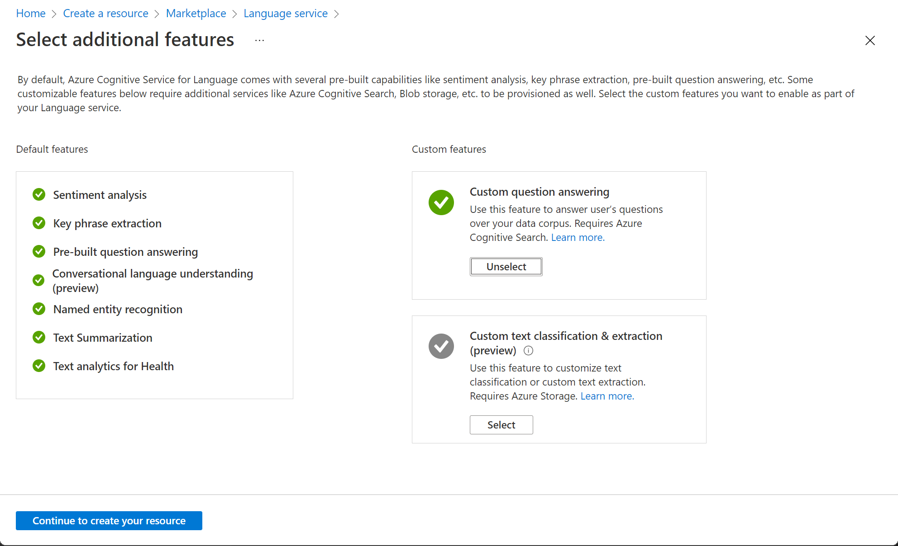

---
lab:
  title: Menjelajahi jawaban atas pertanyaan
---

# Menjelajahi jawaban atas pertanyaan

> **Catatan** Untuk menyelesaikan lab ini, Anda memerlukan [langganan Azure](https://azure.microsoft.com/free?azure-portal=true) dengan akses administrator.

Untuk skenario dukungan pelanggan, bot biasanya dibuat untuk menafsirkan dan menjawab pertanyaan yang sering diajukan melalui jendela obrolan situs web, email, atau antarmuka suara. Yang mendasari antarmuka bot adalah Pangkalan Pengetahuan tentang pertanyaan dan jawaban yang tepat bahwa bot dapat mencari tanggapan yang sesuai.

## Membuat pangkalan pengetahuan jawaban atas pertanyaan kustom

Fitur jawaban atas pertanyaan kustom layanan Bahasa memungkinkan Anda membuat pangkalan pengetahuan dengan cepat, baik dengan memasukkan pasangan tanya jawab atau dari dokumen atau halaman web yang ada. Layanan ini kemudian dapat menggunakan beberapa kemampuan pemrosesan bahasa alami bawaan untuk menafsirkan pertanyaan dan menemukan jawaban yang tepat.

1. Buka portal Azure di [https://portal.azure.com](https://portal.azure.com?azure-portal=true), masuk dengan akun Microsoft Anda.

1. Klik tombol **&#65291;Buat sumber daya**, cari *Layanan bahasa*, dan buat sumber daya **Layanan bahasa** dengan pengaturan berikut, lalu klik **Lanjutkan membuat sumber daya Anda**: **Pilih Fitur Tambahan**
    - **Fitur bawaan**: *Pertahankan fitur bawaan*.
    - **Fitur kustom**: *Pilih jawaban atas pertanyaan kustom*.

    

1. Pada halaman **Buat Bahasa**, tentukan pengaturan berikut:
    - **Langganan**: *Langganan Azure Anda*.
    - **Grup sumber daya**: *Pilih grup sumber daya yang ada atau buat yang baru*.
    - **Nama**: *Nama unik untuk sumber daya Bahasa Anda*.
    - **Tingkat harga**: S (1K Panggilan per menit)
    - **Wilayah pencarian Azure**: *Lokasi apa pun yang tersedia*.
    - **Tingkat harga pencarian Azure**: F Gratis (3 Indeks) - (*Jika tingkat ini tidak tersedia, pilih Standar S (50 Indeks)* )
    - **Dengan mencentang kotak ini, saya menyatakan bahwa saya telah meninjau dan menyetujui persyaratan dalam Pemberitahuan AI yang Bertanggung Jawab**: *Dipilih*.

    > **Catatan** Jika telah menyediakan sumber daya **Azure Cognitive Search** tingkat gratis, kemungkinan, kuota Anda tidak memungkinkan membuat yang lain. Dalam hal ini, pilih tingkat selain **F Gratis**.

1. Klik **Tinjau dan Buat**, lalu klik **Buat**. Tunggu penyebaran layanan Bahasa yang akan mendukung pangkalan pengetahuan jawaban atas pertanyaan kustom Anda.

1. Di tab browser baru, buka portal Language Studio di [https://language.azure.com](https://language.azure.com?azure-portal=true) dan masuk menggunakan akun Microsoft yang terkait dengan langganan Azure Anda.

1. Jika diminta untuk memilih sumber daya Bahasa, pilih pengaturan berikut:
    - **Direktori Azure**: Direktori Azure yang berisi langganan Anda.
    - **Langganan Azure**: Langganan Azure Anda.
    - **Sumber daya bahasa**: Sumber daya bahasa yang Anda buat sebelumnya.

1. Jika Anda ***tidak*** diminta untuk memilih sumber daya bahasa, itu mungkin karena Anda memiliki beberapa sumber daya Bahasa dalam langganan Anda; dalam hal ini:
    1. Pada bilah di bagian atas halaman, klik tombol **Pengaturan (&#9881;)**.
    2. Pada halaman **Pengaturan**, lihat tab **Sumber Daya**.
    3. Pilih sumber daya bahasa yang baru saja Anda buat, dan klik **Ganti sumber daya**.
    4. Di bagian atas halaman, klik **Language Studio** untuk kembali ke beranda Language Studio.

1. Di bagian atas portal Language Studio, di menu **Buat baru**, pilih **Jawaban atas pertanyaan kustom**.

1. Pada halaman **Pilih pengaturan bahasa untuk sumber daya *sumber daya Anda***, pilih **Saya ingin memilih bahasa saat membuat proyek di sumber daya ini** dan klik **Berikutnya**.

1. Pada halaman **Masukkan informasi dasar**, masukkan detail berikut dan klik **Berikutnya**:
    - **Sumber daya bahasa**: *pilih sumber daya bahasa Anda*.  
    - **Sumber daya penelusuran Azure**: *pilih sumber daya penelusuran Azure Anda*.
    - **Nama**: MargiesTravel
    - **Deskripsi**: Pangkalan pengetahuan sederhana
    - **Bahasa sumber**: Ba Inggris
    - **Jawaban default ketika tidak ada jawaban yang ditampilkan**: Tidak ada jawaban yang ditemukan

1. Pada halaman **Tinjau dan selesaikan**, klik **Buat proyek**.

1. Anda akan dibawa ke halaman **Kelola sumber**. Klik **&#65291;Tambahkan sumber** dan pilih **URL**.

1. Di kotak **Tambahkan URL**, klik **+ Tambahkan url**. Ketik seperti berikut dan pilih **Tambahkan semua**:
    - **Nama URL**: MargiesKB
    - **URL**: `https://raw.githubusercontent.com/MicrosoftLearning/AI-900-AIFundamentals/main/data/qna/margies_faq.docx`
    - **Klasifikasikan struktur file**: *Deteksi otomatis* 

## Mengedit Pangkalan Pengetahuan

Pangkalan Pengetahuan Anda didasarkan pada detail dalam dokumen FAQ dan beberapa tanggapan yang ditentukan sebelumnya. Anda dapat menambahkan pasangan tanya jawab kustom untuk melengkapinya.

1. Klik **Edit pangkalan pengetahuan** di panel sebelah kiri. Kemudian klik **+ Tambahkan pasangan pertanyaan**.

1. Di kotak **Pertanyaan**, ketik `Hello`, lalu klik **Kirim perubahan**.

1. Klik **+ Tambahkan frasa alternatif** dan ketik `Hi`, lalu klik **Kirim perubahan**.

1. Di kotak **Jawab dan perintah**, ketik `Hello`. Simpan **Sumber**: Editorial.

1. Klik **Kirim**. Kemudian di bagian atas halaman klik **Simpan perubahan**. Anda mungkin perlu mengubah ukuran jendela Anda untuk melihat tombol.

## Melatih dan menguji pangkalan pengetahuan

Sekarang setelah Anda memiliki pangkalan pengetahuan, Anda dapat mengujinya.

1. Di bagian atas halaman, klik **Uji** untuk menguji pangkalan pengetahuan Anda.

1. Di panel uji, masukkan pesan *Hai* di bagian bawah. Respons **Halo** akan muncul.

1. Di panel uji, di bagian bawah, masukkan pesan *Saya ingin memesan tiket pesawat*. Respons yang tepat dari FAQ akan muncul.

    > **Catatan** Respons mencakup *jawaban singkat* serta *bagian jawaban* yang lebih bertele-tele - bagian jawaban menampilkan teks lengkap dalam dokumen FAQ untuk pertanyaan yang paling cocok, sedangkan jawaban singkatnya diambil secara cerdas dari bagian tersebut. Anda dapat mengontrol apakah jawaban singkat berasal dari respons dengan menggunakan kotak centang **Tampilkan jawaban singkat** di bagian atas panel uji.

1. Coba pertanyaan lain, seperti *Bagaimana cara membatalkan reservasi?*

1. Setelah selesai menguji pangkalan pengetahuan, klik **Uji** untuk menutup panel pengujian.

## Membuat bot untuk Pangkalan Pengetahuan

Pangkalan Pengetahuan menyediakan layanan back-end yang dapat digunakan aplikasi klien untuk menjawab pertanyaan melalui semacam antarmuka pengguna. Umumnya, aplikasi klien ini berupa bot. Agar Pangkalan Pengetahuan tersedia untuk bot, Anda harus menerbitkannya sebagai layanan yang dapat diakses melalui HTTP. Kemudian, Anda dapat menggunakan Azure Bot Service untuk membuat dan meng-host bot yang menggunakan Pangkalan Pengetahuan untuk menjawab pertanyaan pengguna.

1. Di sebelah kiri halaman Language Studio, klik **Sebarkan pangkalan pengetahuan**.

1. Di bagian atas halaman, klik **Sebarkan**, lalu klik **Sebarkan** lagi.

1. Setelah layanan disebarkan, klik **Buat bot**. Tindakan ini akan membuka portal Azure di tab browser baru sehingga Anda dapat membuat Bot Aplikasi Web di langganan Azure Anda.

1. Di portal Azure, buat Bot Aplikasi Web dengan pengaturan berikut (sebagian besar akan diisi sebelumnya untuk Anda):
    - **Handle bot**: *Nama unik untuk bot Anda*
    - **Langganan**: *Langganan Azure Anda*
    - **Grup sumber daya**: *Grup sumber daya yang berisi sumber daya Bahasa Anda*
    - **Lokasi**: *Lokasi yang sama dengan layanan Bahasa Anda*.
    - **Tingkatan harga**: Gratis (F0)
    - **Nama aplikasi**: *Sama seperti **Handle bot** dengan **.azurewebsites.net** yang ditambahkan secara otomatis*
    - **Bahasa SDK**: *Pilih C# atau Node.js*
    - **Kunci Sumber Daya Bahasa**: *dibuat secara otomatis, jika Anda tidak melihatnya, Anda harus mulai dengan membuat proyek jawaban atas pertanyaan di Language Studio* 
    - **Paket/Lokasi layanan aplikasi**: *Pilih panah untuk membuat paket. Kemudian buat nama paket layanan Aplikasi yang unik dan pilih lokasi yang sesuai*
    - **Application Insights**: Nonaktif
    - **ID dan kata sandi Aplikasi Microsoft**: *Membuat ID dan kata sandi Aplikasi secara otomatis*

1. Tunggu hingga bot Anda selesai dibuat (ikon pemberitahuan di kanan atas, yang terlihat seperti bel, akan dianimasikan saat Anda menunggu). Kemudian, di pemberitahuan bahwa penyebaran telah selesai, klik **Buka sumber daya** (atau sebagai alternatif, di beranda, klik **Grup sumber daya**, buka grup sumber daya tempat Anda membuat bot aplikasi web, lalu klik.)

1. Di panel sebelah kiri bot Anda cari **Pengaturan**, klik **Uji di Web Chat**, dan tunggu sampai bot menampilkan pesan **Halo dan Selamat Datang** (mungkin perlu beberapa detik untuk menginisialisasi).

1. Gunakan antarmuka obrolan uji untuk memastikan bahwa bot Anda menjawab pertanyaan dari Pangkalan Pengetahuan Anda seperti yang diharapkan. Misalnya, coba kirim *saya harus membatalkan hotel saya*.

Melakukan eksperimen dengan bot. Anda mungkin akan mendapati bahwa pertanyaan dapat dijawab dari FAQ dengan cukup akurat, tetapi kemampuan dalam menafsirkan pertanyaan yang belum dilatih masih terbatas. Anda selalu dapat menggunakan Language Studio untuk mengedit pangkalan pengetahuan untuk menyempurnakannya dan menerbitkannya kembali.

## Pelajari lebih lanjut

- Untuk mempelajari selengkapnya tentang layanan Jawaban Atas Pertanyaan, lihat [dokumentasi](https://docs.microsoft.com/azure/cognitive-services/language-service/question-answering/overview).
- Untuk mempelajari Microsoft Bot Service lebih lanjut, lihat [Halaman Azure Bot Service](https://azure.microsoft.com/services/bot-service/).
