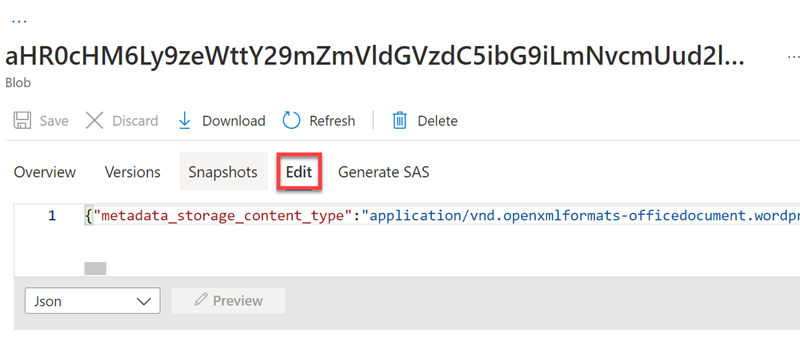

---
lab:
  title: Menjelajahi pendalaman pengetahuan
---

# Menjelajahi pendalaman pengetahuan

> **Catatan** Untuk menyelesaikan lab ini, Anda memerlukan [langganan Azure](https://azure.microsoft.com/free?azure-portal=true) dengan akses administrator.

Bayangkan Anda bekerja untuk Fourth Coffee, rantai kopi nasional. Anda diminta untuk membantu membangun solusi penggalian pengetahuan yang memudahkan pencarian wawasan tentang pengalaman pelanggan. Anda memutuskan untuk membuat indeks Azure Cognitive Search menggunakan data yang diambil dari ulasan pelanggan.  

Di lab ini Anda akan:

- Membuat sumber daya Azure
- Mengekstrak data dari sumber data
- Memperkaya data dengan kemampuan AI
- Menggunakan pengindeks Azure di portal Microsoft Azure
- Mengkueri indeks pencarian
- Meninjau hasil yang disimpan ke Penyimpanan Pengetahuan

## Sumber daya Azure yang dibutuhkan

Solusi yang akan Anda buat untuk Fourth Coffee memerlukan sumber daya berikut dalam langganan Azure Anda:

- Sumber daya **Azure Cognitive Search**, yang akan mengelola pengindeksan dan kueri.
- Sumber **daya layanan** Azure AI, yang menyediakan layanan AI untuk keterampilan yang dapat digunakan solusi pencarian Anda untuk memperkaya data di sumber data dengan wawasan yang dihasilkan AI.

    > **Perhatikan** sumber daya layanan Azure Cognitive Search dan Azure AI Anda harus berada di lokasi yang sama!

- **Akun penyimpanan** dengan kontainer blob, yang akan menyimpan dokumen mentah dan kumpulan tabel, objek, atau file lainnya.

### Membuat sumber daya *Azure Cognitive Search*

1. Masuk ke [Portal Microsoft Azure](https://portal.azure.com/learn.docs.microsoft.com?azure-portal=true).

1. Klik tombol **+ Buat sumber daya**, cari *Azure Cognitive Search*, dan buat sumber daya **Azure Cognitive Search** dengan pengaturan berikut:

    - **Langganan**: *Langganan Azure Anda*.
    - **Grup sumber daya**: *Pilih atau buat grup sumber daya dengan nama unik*.
    - **Nama layanan**: *Nama yang unik*.
    - **Lokasi**: *Pilih wilayah yang tersedia*.
    - **Tingkat harga**: Dasar

1. Pilih **Tinjau + buat**, dan setelah Anda melihat respons **Validasi Sukses**, pilih **Buat**.

1. Setelah penyebaran selesai, pilih **Buka sumber daya**. Pada halaman gambaran umum Azure Cognitive Search, Anda dapat menambahkan indeks, mengimpor data, dan mencari indeks yang dibuat.

### Buat sumber daya Layanan Azure AI

Anda harus menyediakan **sumber daya layanan** Azure AI yang berada di lokasi yang sama dengan sumber daya Azure Cognitive Search Anda. Solusi pencarian Anda akan menggunakan sumber daya ini untuk memperkaya data di datastore dengan wawasan yang dihasilkan AI.

1. Kembali ke halaman beranda portal Azure. Klik tombol **＋Buat sumber daya**dan cari *layanan Azure AI*. Pilih **buat** paket **layanan Azure AI**. Anda akan diarahkan ke halaman untuk membuat sumber daya layanan Azure AI. Konfigurasikan dengan pengaturan berikut:
    - **Langganan**: *Langganan Azure Anda*.
    - **Grup sumber daya**: *Grup sumber daya yang sama dengan sumber daya Azure Cognitive Search Anda*.
    - **Wilayah**: *Lokasi yang sama dengan sumber daya Azure Cognitive Search Anda*.
    - **Nama**: *Nama yang unik*.
    - **Tingkat harga**: Standar S0
    - **Dengan mencentang kotak ini, saya menyatakan bahwa saya telah membaca dan memahami semua persyaratan di bawah**: Dipilih

1. Pilih **Tinjau + buat**. Setelah Anda melihat respons **Validasi Berhasil**, pilih **Buat**.

1. Tunggu hingga penyebaran selesai, lalu lihat detail penyebaran.

### Buat akun penyimpanan

1. Kembali ke beranda portal Microsoft Azure, lalu pilih tombol **+ Buat sumber daya**.

1. Cari *akun penyimpanan*, dan buat sumber daya **Akun penyimpanan** dengan pengaturan berikut:
    - **Langganan**: *Langganan Azure Anda*.
    - **Grup** sumber daya: *Grup sumber daya yang sama dengan sumber daya* layanan Azure Cognitive Search dan Azure AI Anda.
    - **Nama akun penyimpanan**: *Nama yang unik*.
    - **Lokasi**: *Pilih lokasi yang tersedia*.
    - **Performa**: Standar
    - **Redundansi**: Penyimpanan redundan secara lokal (LRS)

1. Klik **Tinjau** lalu klik **Buat**. Tunggu hingga penyebaran selesai, lalu buka sumber daya yang disebarkan.

1. Di akun Azure Storage yang Anda buat, di panel menu sebelah kiri, pilih **Konfigurasi** (di bawah **Pengaturan**).
1. Ubah pengaturan untuk *Izinkan akses* anonim Blob ke **Diaktifkan** lalu pilih **Simpan**.

## Mengunggah Dokumen ke Azure Storage

1. Di panel menu sebelah kiri, pilih **Kontainer**.

    

1. Pilih **+Kontainer**. Panel di sisi kanan Anda terbuka.

1. Masukkan pengaturan berikut, dan klik **Buat**:
    - **Nama**: coffee-reviews  
    - **Tingkat akses publik**: Kontainer (akses baca anonim untuk kontainer dan blob)
    - **Tingkat Lanjut**: *tidak ada perubahan*.

1. Di tab browser baru, unduh dokumen yang di-zip dari https://aka.ms/km-documents, lalu ekstrak file ke folder *ulasan*.

1. Di portal Microsoft Azure, pilih kontainer *coffee-reviews* Anda. Di kontainer, pilih **Unggah**.

    

1. Di panel **Unggah blob**, pilih **Pilih file**.

1. Di jendela Penjelajah, pilih **semua** file di folder *ulasan*, pilih **Buka**, lalu pilih **Unggah**.

    

1. Setelah pengunggahan selesai, Anda dapat menutup panel **Unggah blob**. Dokumen Anda sekarang ada di kontainer penyimpanan *ulasan kopi* Anda.

## Mengindeks dokumen

Setelah Anda menyimpan dokumen, Anda dapat menggunakan Azure Cognitive Search untuk mengekstrak wawasan dari dokumen. Portal Microsoft Azure menyediakan *Wizard Impor data*. Dengan wizard ini, Anda dapat secara otomatis membuat indeks dan pengindeks untuk sumber data yang didukung. Anda akan menggunakan wizard untuk membuat indeks, dan mengimpor dokumen pencarian Anda dari penyimpanan ke dalam indeks Azure Cognitive Search.

1. Di portal Microsoft Azure, caari sumber daya Azure Cognitive Search Anda. Pada halaman **Gambaran Umum**, pilih **Impor data**.

    

1. Pada halaman **Hubungkan ke data Anda**, dalam daftar **Sumber Data**, pilih **Azure Blob Storage**. Lengkapi detail penyimpanan data dengan nilai berikut:
    - **Sumber** Data: Azure Blob Storage
    - **Nama sumber data**: coffee-customer-data
    - **Data yang akan diekstrak**: Konten dan metadata
    - **Mode penguraian**: Default
    - **String koneksi**: *Pilih **Pilih koneksi yang ada**. Pilih akun penyimpanan Anda, pilih kontainer **ulasan kopi**, lalu klik **Pilih**.
    - **Autentikasi identitas terkelola**: Tidak ada
    - **Nama kontainer**: *pengaturan ini diisi secara otomatis setelah Anda memilih koneksi yang ada*.
    - **Blob folder**: *Biarkan ini kosong*.
    - **Deskripsi**: Ulasan untuk Kedai Fourth Coffee.

1. Pilih **Berikutnya: Tambahkan keterampilan kognitif (Opsional)**.

1. Di bagian **Lampirkan Cognitive Services** , pilih sumber daya layanan Azure AI Anda.  

1. Di bagian **Tambahkan pengayaan**:
    - Ubah **Nama Set Kemampuan** menjadi **coffee-skillset**.
    - Pilih kotak centang **Aktifkan OCR dan gabungkan semua teks ke dalam bidang merged_content**.
        > **Catatan** Penting untuk memilih **Aktifkan OCR** guna melihat semua opsi bidang yang diperkaya.
    - Pastikan **bidang data Sumber** diatur ke **merged_content**.
    - Ubah **Tingkat perincian pengayaan** menjadi **Halaman (5000 karakter potongan)**.
    - Jangan pilih *Aktifkan pengayaan bertahap*
    - Pilih bidang yang diperkaya berikut:

        | Kemampuan Kognitif | Parameter | Nama bidang |
        | --------------- | ---------- | ---------- |
        | Ekstrak nama lokasi | | locations |
        | Mengekstrak frasa kunci | | frasa kunci |
        | Deteksi sentimen | | sentimen |
        | Buat tag dari gambar | | imageTags |
        | Buat keterangan dari gambar | | imageCaption |

1. Di bagian **Simpan pengayaan ke penyimpanan pengetahuan**, pilih:
    - Proyeksi gambar
    - Dokumen
    - Halaman
    - Frasa kunci
    - Entitas
    - Detail gambar
    - Referensi gambar

    > **Catatan** Jika muncul peringatan yang meminta **String Koneksi Akun Penyimpanan**.
    >
    > 
    >
    > 1. Pilih **Pilih koneksi yang ada**. Pilih akun penyimpanan yang Anda buat sebelumnya.
    > 1. **Klik + Kontainer** untuk membuat kontainer baru yang disebut **penyimpanan pengetahuan** dengan tingkat privasi yang diatur ke **Privat**, dan pilih **Buat**.
    > 1. Pilih kontainer **penyimpanan pengetahuan**, lalu klik **Pilih** di bagian bawah layar.

1. Pilih **Proyeksi blob Azure: Dokumen**. Pengaturan untuk *Nama kontainer* dengan tampilan kontainer *penyimpanan pengetahuan* yang terisi secara otomatis. Jangan ubah nama kontainer.

1. Pilih **Berikutnya: Sesuaikan indeks target**. Ubah **Nama indeks** menjadi **coffee-index**.

1. Pastikan **Kunci** diatur ke **metadata_storage_path**. Biarkan **Nama pemberi saran** kosong dan **Mode pencarian** terisi otomatis.

1. Tinjau pengaturan default bidang indeks. Pilih **dapat difilter** untuk semua bidang yang telah dipilih secara default.

    

1. Pilih **Berikutnya: Membuat pengindeks**.

1. Ubah **Nama pengindeks** menjadi **coffee-indexer**.

1. Biarkan **Jadwal** diatur ke **Sekali**.

1. Luaskan **Opsi tingkat lanjut**. Pastikan opsi **Kunci Pengodean Base-64** dipilih, karena kunci pengodean dapat membuat indeks lebih efisien.

1. Pilih **Kirim** untuk membuat sumber data, set kemampuan, indeks, dan pengindeks. Pengindeks dijalankan secara otomatis dan menjalankan alur pengindeksan, yang:
    - Ekstrak bidang dan konten metadata dokumen dari sumber data.
    - Jalankan kumpulan keterampilan dari keterampilan kognitif untuk menghasilkan bidang yang lebih diperkaya.
    - Memetakan bidang yang diekstraksi ke indeks.

1. Di paruh bawah halaman **Ringkasan** untuk sumber daya Azure Cognitive Search Anda, pilih tab **Pengindeks**. Tab ini menampilkan **pengindeks kopi** yang baru dibuat. Tunggu sebentar, lalu pilih **&orarr; Refresh** hingga **Status** menunjukkan berhasil.

1. Pilih nama pengindeks untuk melihat detail selengkapnya.

    

## Mengkueri indeks

Gunakan penjelajah Pencarian untuk menulis dan menguji kueri. Search explorer adalah alat yang disertakan dalam portal Microsoft Azure yang memberi Anda cara mudah untuk memvalidasi kualitas indeks pencarian Anda. Anda dapat menggunakan Penjelajah pencarian untuk menulis kueri dan meninjau hasil di JSON.

1. Di halaman *Ringkasan* layanan Pencarian, pilih **Penjelajah pencarian** di bagian atas layar.

   

1. Perhatikan bagaimana indeks yang dipilih adalah *indeks kopi* yang Anda buat.

    

    Di bidang **String kueri**, masukkan`search=*&$count=true`, lalu pilih **Cari**. Kueri pencarian menampilkan semua dokumen dalam indeks pencarian, termasuk jumlah semua dokumen di bidang **@odata.count**. Indeks pencarian harus mengembalikan dokumen JSON yang berisi hasil pencarian Anda.

    > **Catatan** Jika muncul pesan **Untuk mencari di portal, izinkan asal portal di pengaturan CORS indeks Anda**, pilih **Izinkan portal**, lalu pilih **Cari**.

1. Sekarang mari kita filter berdasarkan lokasi. `search=locations:'Chicago'`Di bidang **String kueri**, masukkan, lalu pilih **Cari**. Kueri mencari semua dokumen dalam indeks dan menyaring tinjauan dengan lokasi Chicago.

1. Sekarang mari kita filter berdasarkan sentimen. `search=sentiment:'negative'`Di bidang **String kueri**, masukkan, lalu pilih **Cari**. Kueri mencari semua dokumen dalam indeks dan menyaring tinjauan dengan sentimen negatif.

   > **Catatan** Lihat bagaimana hasil diurutkan berdasarkan `@search.score`. Ini adalah skor yang diberikan oleh mesin pencari untuk menunjukkan seberapa dekat hasil cocok dengan kueri yang diberikan.

1. Salah satu masalah yang mungkin perlu kita pecahkan adalah mengapa mungkin ada ulasan tertentu. Mari kita lihat frasa kunci yang terkait dengan ulasan negatif. Menurut Anda apa yang mungkin menjadi penyebab peninjauan?

## Tinjau penyimpanan pengetahuan

Mari kita lihat kekuatan penyimpanan pengetahuan saat digunakan. Saat Anda menjalankan *Wizard Impor data*, Anda juga membuat penyimpanan pengetahuan. Di dalam penyimpanan pengetahuan, Anda akan menemukan data yang diperkaya yang diekstrak oleh keterampilan AI yang tetap ada dalam bentuk proyeksi dan tabel.

1. Di portal Microsoft Azure, navigasikan kembali ke akun penyimpanan Azure Anda.

1. Di panel menu sebelah kiri, pilih **Kontainer**. Pilih kontainer **penyimpanan pengetahuan**.

    

1. Pilih salah satu item, lalu klik file **objectprojection.json**.

    

1. Pilih **Edit** guna melihat JSON yang dihasilkan untuk salah satu dokumen dari penyimpanan data Azure Anda.

    

1. Pilih breadcrumb blob penyimpanan di kiri atas layar untuk kembali ke *Kontainer* akun Penyimpanan.

    

1. Di *Kontainer*, pilih kontainer *coffee-skillset-image-projection*. Pilih salah satu item.

    

1. Pilih salah satu file *.jpg*. Pilih **Edit** untuk melihat gambar yang disimpan dari dokumen. Perhatikan bagaimana semua gambar dari dokumen disimpan dengan cara ini.

    

1. Pilih breadcrumb blob penyimpanan di kiri atas layar untuk kembali ke *Kontainer* akun Penyimpanan.

1. Pilih **Browser penyimpanan** di panel sebelah kiri, lalu pilih **Tabel**. Terdapat tabel untuk setiap entitas dalam indeks. Pilih tabel *coffeeSkillsetKeyPhrases*.

    Lihat frasa kunci yang dapat diambil oleh penyimpanan pengetahuan dari konten di ulasan. Banyak bidang adalah kunci, sehingga Anda dapat menautkan tabel seperti database hubungan. Bidang terakhir menunjukkan frase kunci yang diekstrak oleh kumpulan keterampilan.

## Pelajari selengkapnya

Indeks pencarian sederhana ini hanya beberapa contoh dari kemampuan layanan Azure Cognitive Search. Untuk mempelajari selengkapnya tentang apa yang dapat Anda lakukan dengan layanan ini, lihat [halaman layanan Azure Cognitive Search](/azure/search/search-what-is-azure-search).
